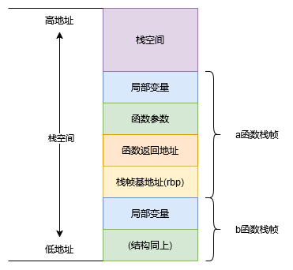
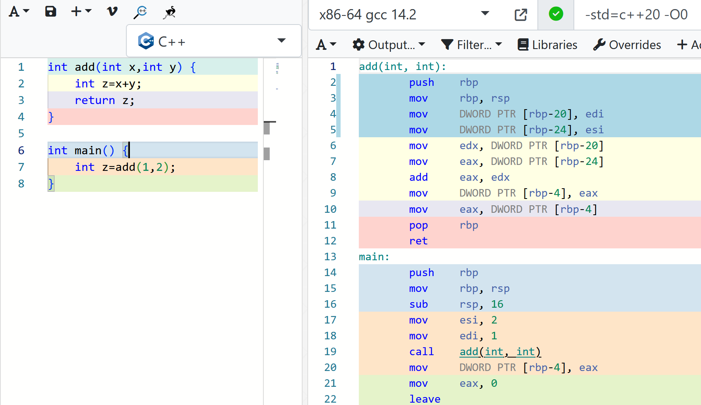
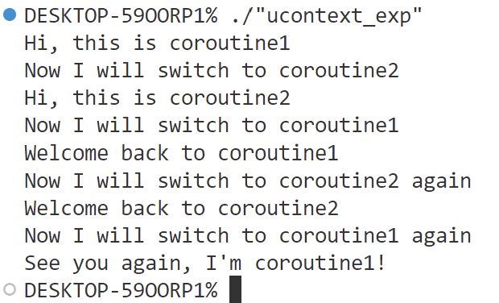

# 有栈协程VS无栈协程

## 有栈协程VS无栈协程

上一节中我们对协程这一概念有了初步的了解，事实上协程已经作为异步编程的重要手段被应用了很多年，javascript、golang还有python早早就内置了协程，而C++也终于在20标准中添加了协程支持。协程并非一个具体技术，而是一种编程方法，针对不同的实现方式我们也可以划分不同的协程技术。例如根据协程调度中调度权的分配可分为对称协程和非对称协程。

- **对称协程**：所有协程独立且平等，调度权可在任意协程间进行转移，公平式调度。
- **非对称协程**：协程之间存在调用关系，如果协程让出调度权目标一定是调用者（发起调用的一方）。

而按照运行时协程栈的分配方式又可分为**有栈协程**和**无栈协程**，注意这里是**按照栈分配方式划分而非有无栈**。本节将会带领大家学习有栈协程和无栈协程的具体区别，这会让我们对理解C++协程更进一步。

#### 知识点

- 有栈栈协程原理
- 无栈协程原理
- C++协程设计思路

## 有栈协程

#### 普通函数调用

在讲解有栈协程之前我们来回顾一下函数调用这个过程，首先是重要的数据结构栈帧，假设a函数调用了b函数，栈帧结构如下图所示：



为了方便理解上图，我们写个简单的函数来观察编译器如何处理栈帧，注意本节代码采用[godbolt](https://godbolt.org/)在线编辑器演示，编译器选择x86-64 gcc 14.2。



我们看右侧汇编代码，第2，3行的指令是将上一个栈帧的基地址压入栈，然后更新当前栈帧基地址rbp。局部变量z的地址位于[rbp-4]，入参x和y的地址分别在[rbp-20]和[rbp-24]，这表明局部变量确实处在栈地址更高的位置。至于函数返回地址，我们在调用函数的时候call指令会帮我们将此地址压栈。

综上来看，栈帧即是函数的上下文环境，函数调用即是栈帧的切换。由于函数调用严格遵循嵌套关系，所以用栈存储函数上下文信息最为合适。

#### 有栈协程解析

而有栈协程则是利用了这种思想，我们将协程看做普通的函数，如果我们分配了一片内存空间用于存储当前的上下文，我们便可以手动对函数进行自由的切换，想要恢复函数只需要找到持有待恢复函数的上下文信息的内存地址即可。注意能够自由切换的有栈协程也属于对称协程，因为不遵循严格嵌套关系，上下文信息的存储空间需要用户自己分配。

##### 💻协程实验：实现简易有栈协程

linux自带的一套用于获取、修改和切换当前线程上下文的ucontext库为我们提供了实现简易有栈协程的能力。

ucontext库的核心数据结构如下：

```c
/* Userlevel context.  */
typedef struct ucontext_t
  {
    unsigned long int __ctx(uc_flags);
    // 表示当前context执行结束后下一个待执行的context
    struct ucontext_t *uc_link;
    // 存储当前context的上下文栈信息
    stack_t uc_stack;
    // 存储当前context的上下文寄存器信息
    mcontext_t uc_mcontext;
    // 存储当前线程的信号屏蔽码
    sigset_t uc_sigmask;
    struct _libc_fpstate __fpregs_mem;
    __extension__ unsigned long long int __ssp[4];
  } ucontext_t;
```

ucontext库主要提供了四个函数：

```c
/* 获取当前上下文信息并将其存储到ucp指向的context中 */
int getcontext (ucontext_t *__ucp);

/* 将当前上下文切换到设置为ucp指向的context */
int setcontext (const ucontext_t *__ucp);

/* 组合操作，获取当前上下文信息并将其存储到oucp指向的context中并将当前上下文切换到设置为ucp指向的context */
int swapcontext (ucontext_t *__restrict __oucp,
   const ucontext_t *__restrict __ucp);

/* 设置ucp指向的context入口函数为func  */
void makecontext (ucontext_t *__ucp, void (*__func) (void),
    int __argc, ...);
```

关于上述函数的具体实现原理，可参考[linux ucontext族函数的原理及使用](https://blog.csdn.net/chenzhjlf/article/details/124606523)。

我们基于上述函数可以写一个简易的协程。

```cpp
#include <ucontext.h>
#include <memory>
#include <iostream>

using namespace std;
/*
执行流程切换图
main     coroutine1  coroutine2
 |
 |
 |---------->|
             |
             |---------->|
                         |
                         |
             |<----------|
             |
             |---------->|
                         |
             |<----------|
             |
             |(end)
 */
ucontext_t ctx0, ctx1, ctx2;

void coroutine1()
{
  cout << "Hi, this is coroutine1" << endl;
  cout << "Now I will switch to coroutine2" << endl;
  swapcontext(&ctx1, &ctx2);
  cout << "Welcome back to coroutine1" << endl;
  cout << "Now I will switch to coroutine2 again" << endl;
  swapcontext(&ctx1, &ctx2);
  cout << "See you again, I'm coroutine1!" << endl;
}

void coroutine2()
{
  cout << "Hi, this is coroutine2" << endl;
  cout << "Now I will switch to coroutine1" << endl;
  swapcontext(&ctx2, &ctx1);
  cout << "Welcome back to coroutine2" << endl;
  cout << "Now I will switch to coroutine1 again" << endl;
  swapcontext(&ctx2, &ctx1);
}

int main(int argc, char const *argv[])
{
  // 为context存储栈信息分配内存空间
  ctx0.uc_link = nullptr;
  ctx0.uc_stack.ss_sp = malloc(1024);
  ctx0.uc_stack.ss_size = 1024;
  ctx0.uc_link = NULL;

  ctx1.uc_link = nullptr;
  ctx1.uc_stack.ss_sp = malloc(1024);
  ctx1.uc_stack.ss_size = 1024;
  ctx1.uc_link = NULL;

  ctx2.uc_link = nullptr;
  ctx2.uc_stack.ss_sp = malloc(1024);
  ctx2.uc_stack.ss_size = 1024;
  ctx2.uc_link = NULL;

  getcontext(&ctx1);
  makecontext(&ctx1, coroutine1, 0);

  getcontext(&ctx2);
  makecontext(&ctx2, coroutine2, 0);

  swapcontext(&ctx0, &ctx1);

  // 释放空间
  free(ctx0.uc_stack.ss_sp);
  free(ctx1.uc_stack.ss_sp);
  free(ctx2.uc_stack.ss_sp);

  return 0;
}
```

上述代码不难理解，运行效果如下：

{:height="50%" width="50%"}

注意程序在coroutine1函数结束后并没有返回到main函数，而是直接结束运行，因为ucontext结构体中的uc_link字段用于指定当前上下文结束后返回的上下文。如果uc_link设置为NULL，则当前上下文结束后不会返回任何上下文，程序会终止，若想返回main函数我们需要在coroutine1函数末尾手动执行切换。

其次是makecontext主要是修改上下文信息，因此需要和getcontext搭配使用先填充好上下文信息。

这里读者可能会有疑问**前面提到ucontext是linux下用于切换线程上下文的库，这里为何将其用作有栈协程的演示**？其实有栈协程的实现方式有很多，ucontext这种切换上下文的机制也符合有栈协程的定义，不过ucontext的效率并不高，如果阅读源码的话会发现甚至会涉及到系统调用以及一些专门针对线程数据切换的指令（可以适当删减），如果是想要更轻量级的有栈协程，可以对ucontext的上下文切换过程做一些精简。除了ucontext外，还有像腾讯微信的libco有栈协程库，通过牺牲了平台通用性减少指令来降低协程切换的损耗，读者若想详细了解libco可查看这篇博客：[有栈协程和无栈协程](https://cloud.tencent.com/developer/article/1888257)。

## 无栈协程

虽然有栈协程只要保留了栈信息便可以任意切换，但缺点是性能有损耗，栈信息的拷贝会影响性能，而且分配的存储栈信息的内存空间可能需要动态调整，进一步降低了性能。为了避免这个问题，无栈协程选择了从另外一个角度切入，因为同一协程的协程切换本质不过是指令指针寄存器的改变，所以可以将协程的切换过程看作是状态机，比如下面这段代码。

```cpp
#include <iostream>
using namespace std;
class StateMachine
{
public:
  void run()
  {
    switch (state)
    {
    case 0:
      cout << "run state is " << state << endl;
      state++;
      break;
    case 1:
      cout << "run state is " << state << endl;
      state++;
      break;
    case 2:
      cout << "run state is " << state << endl;
      state++;
      break;
    default:
      cout << "run finish" << endl;
      break;
    }
  }
private:
  int state{0};
};
```

上面的代码演示了一个状态机的类，每次调用run()都会推进state，无栈协程同理，运行一个无栈协程就好比运行一个类的成员函数，当我们进行协程切换后，类成员变量会记录当下的运行状态，协程恢复运行后会基于存储的运行状态继续执行。

上述将无栈协程比作状态机的说法是目前网上协程博客的共同观点，但看完上述对于这句话的解释可能很多读者还是觉得有些云里雾里，下面给出给通俗的解释。

把整个协程抽象成一个类，以原本需要执行切换的语句处为界限，把函数划分为几个部分，并在某一个部分执行完以后进行状态转移，在下一次调用此函数的时候就会执行下一部分，这样的话我们就完全没有必要像有栈协程那样显式的执行上下文切换了，只是需要自行实现协程切换的调度逻辑，所有的协程共用的都是一个栈，即系统栈，也就不必自行去给协程分配栈，因为是函数调用，我们当然也不必去显式的保存寄存器的值。

而且相比有栈协程把局部变量放在新开的空间上，无栈协程直接使用系统栈使得CPU cache局部性更好，同时也使得无栈协程的中断和函数返回几乎没有区别，这样也可以凸显出无栈协程的高效，不过正因为无栈协程不会为栈信息开辟内存空间（注意无栈协程仍然需要内存空间存储当前状态，只是存储的内容与有栈协程不同），它无法实现在任意函数调用层级的位置进行挂起，因此无栈协程通常也是非对称协程。

C++20协程属于无栈协程，想必读者记得C/C++可以在代码行前添加label，利用goto跳转到指令label，汇编代码中也可以添加label并且用jmp指令跳转，后续学习过C++协程后大家可以观察到协程的汇编代码存在大量的label和jmp指令，这正好对应了上述讲到的状态机。

总的来说无栈协程利用状态机思想进行协程切换，避免了有栈协程频繁保留栈等上下文信息带来的性能损耗，也请读者务必理解有栈和无栈具体是什么含义。

## C++协程

终于来到了C++协程的环节，原本可以放在第一章讲，但我更希望通过铺垫更多的前置知识帮助大家更好地理解。C++在20标准支持协程是一件可喜可贺的事，然后C++并非构建了用户直接可用的协程库，而是提供了一套底层方法，由库开发者开发可用的协程库，再由用户直接使用，而本套课程的目的也是指导大家如何构建协程库。

想必阅读过国外计算机类书籍的读者应该熟悉一个名词：**自顶向下方法**，放到计算机知识的学习上可以理解为从应用入手，再到底层原理实现。由于C++协程本身理解起来具有一定难度，因此本课程也采用**自顶向下**的学习顺序，确保读者透彻理解C++协程。

### 理解C++协程设计哲学

上文提到一句话

>把整个协程抽象成一个类，以原本需要执行切换的语句处为界限，把函数划分为几个部分

C++协程正是通过内置的关键字将函数进行了切分，按官方的话说是可以在切分处进行suspend或resume，我更愿意将切分处解释为一个调度点，在调度点处用户决定是否切换协程或者切换到哪个协程。

当C++的函数包含指定关键字（**co_await，co_yield，co_return**）时，编译器会将其看作协程，而在关键字出现的地方编译器会安插调度点，在调度点用户可以使用协程的方法来指定协程是继续运行还是选择切换执行流程。下图（摘自网络）展示了编译器视角下协程的执行流程。


由于上图涉及未讲到的协程的具体方法，读者可不必深究，学完后续课程再来回顾。总之我们可以从上图提取出一个重要信息：**C++协程设计了多种类型的调度点**，我们梳理一下这些调度点。

- **协程创建时**。此处安插调度点主要是方便用户对即将运行的协程做一些准备工作，即协程创建后不必立刻运行，等某些逻辑（例如发起的IO）完成后再执行。
- **协程中每次调用co_await处**。运行过程中调度点主要是为协程切换做准备，用户可在此决定是否切出当前协程，或执行自定义的调度器逻辑。
- **协程销毁时**。此处的调度点主要是为了确定接下来运行哪个协程，比如A协程调用了B协程，B协程执行完之后可以选择切换到C协程执行或者把执行权交回A协程。**注意该调度点之后会执行协程销毁，所以用户不要在此调度点让当前协程继续运行**，一般是选择回到父协程或其他协程，否则会出现core dump。

上述三种类型的调度点几乎覆盖了全部可调度的位置，C++协程为调度点提供了方法，用户填充方法的具体实现来完成调度逻辑，这便是C++20协程所做的工作。

### 疑问解答

本节列出一些阅读过程中读者可能会产生的思考问题。

- **明明C++协程在调度点可以选择切换至非父协程，为何还要说C++协程是非对称协程**？

<!-- TODO -->
> 后续分析C++协程原理的章节我们会看到协程的调用是包裹在函数调用里的，协程结束后就是常规的函数返回操作返回至父调用者（**待补充**）。

## 实验总结

本节讲述了有栈协程的技术原理并用实践演示实现有栈协程，通过分析有栈协程的缺点引出了无栈协程以及技术原理，最后学习了无栈协程的经典代表——C++协程，并告诉了读者C++协程的设计理念，下一节将会入门C++协程应用。
