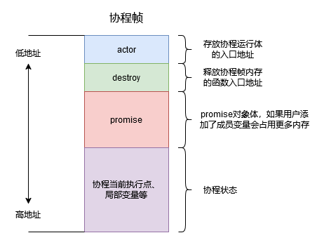
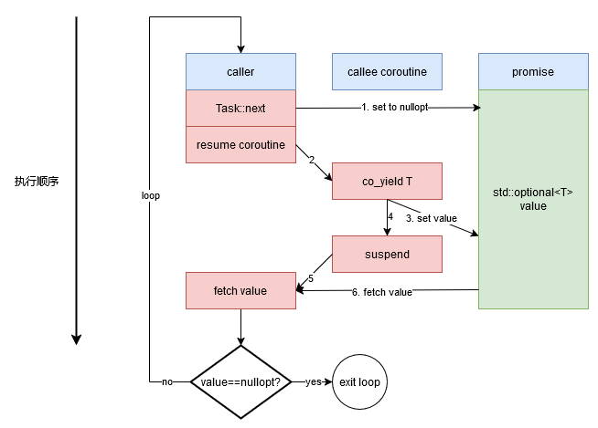
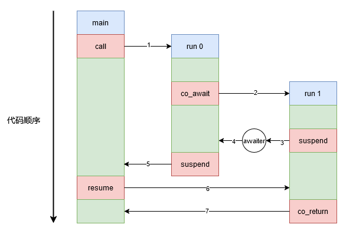
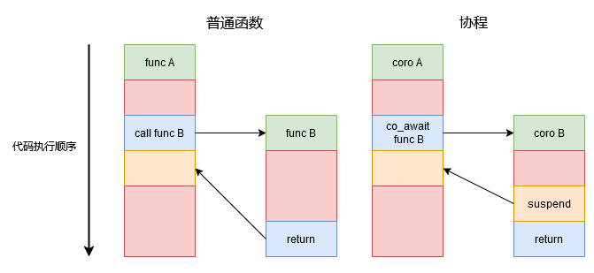
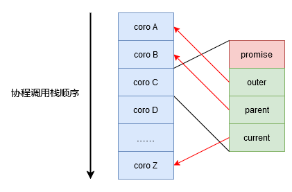
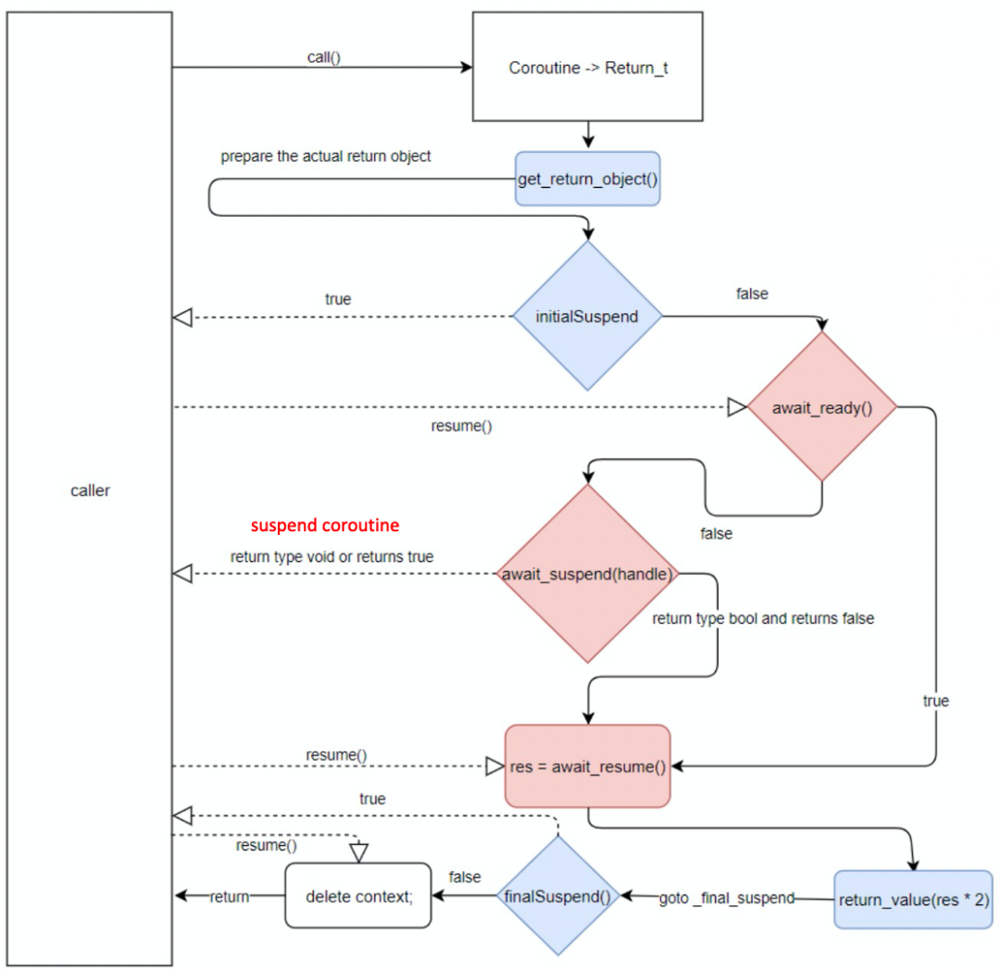

# C++协程入门实践

## C++协程入门实践

上一节我们从顶层设计的角度学习了C++的设计理念，而本节则从实践的角度进行C++协程的入门。与网上大部分的C++协程入门博客类似，本文也会讲述C++20为协程设计的关键字以及方法并给出示例，但本文会尽力照顾初学者给出十分详细的讲解，由于知识点过于庞大，如有错误及时在QQ群内反馈。

#### 知识点

- C++协程之promise编程
- C++协程之awaiter编程
- C++协程之实战演练

## C++协程的定义和执行

如果我们在C++的函数体里添加了co_await，co_return或者co_yield关键字（必须有其一），那么该函数即视为协程。而被视作协程的函数也会受到诸多限制，例如不可以使用return语句，构造函数、析构函数、main函数和constexpr函数均不能成为协程。

每一个协程函数都对应着一个协程对象，而协程对象与下述三种类型的数据相关联。

- **promise对象**。注意这里的promise仅仅是个概念名词，和C++异步编程里的std::promise没有任何关联。协程的构造和运行需要编译器做很多幕后工作，而promise是编译器直接暴露给用户的一个对象，其与协程的运行状态相关联，用户可以通过promise的预定义方法实现调度协程、获取运行结果和异常捕获。
- **协程句柄**。协程句柄本质是一个指针，通过协程句柄用户可以访问对应的promise以及恢复和销毁协程。
- **协程状态**。协程为了实现随时暂停执行并随意恢复的功能，必须在内存空间中保存当前的协程状态，主要涉及协程当前运行位置（便于恢复时继续运行）以及生命周期未结束的局部变量。

上述三种对象可合称为协程帧，内存分布如下图所示，这也很好的解释了为什么协程句柄和promise可以互相转换以及可以利用协程句柄执行协程的恢复和销毁。



通常激活帧被称作一块保留了函数运行状态的内存，对于普通函数激活帧就是栈帧，而对于协程激活帧由两部分组成：

- **栈帧**。与普通函数栈帧结构类似，在调用协程时产生栈帧，协程结束返回给调用者时释放栈帧。
- **协程帧**。用于记录协程中间状态便于协程暂停和恢复执行，主要包含上述介绍的三种与协程相关的数据对象。关于协程帧有两点需要注意：
  - 在创建协程时由编译器分配内存，但注意该内存需要用户手动释放，否则会造成内存泄漏。
  - 通常采用堆分配方式构建协程帧。c++协程提案中有一些规定，如果编译器能够证明协程的生命周期确实严格嵌套在调用者的生命周期内，则允许从调用者的激活帧中分配协程帧的内存。

综上分析，调用者调用协程会执行大概两步：第一步像调用正常函数一样构造栈帧，第二步编译器分配内存构造协程帧。这也解释了为何C++协程的激活帧会分为两部分，第一步操作符合严格嵌套关系所以可被放在栈空间，第二步操作不符合严格嵌套所以利用额外的堆空间存储。

<!-- // FIXME: 表述正确性
另外，本文会将两个关键字suspend和暂停进行区分，协程运行过程中切换执行权可称为suspend或暂停，似乎区别不大，但协程执行完后一定会被suspend，此时称作暂停就不太合适，所以读者可理解为协程至少会被suspend一次。 -->

## Promise

如果不深究C++协程的技术细节而从用户使用角度来讲的话协程可被划分为promise和awaiter，前者我们有所了解，后者主要是实现协程调度逻辑。本小节我们重点讲述promise，下面给出一个C++协程的样例程序（**注意编译器编译C++协程代码需要添加-fcoroutines -std=c++20参数**）。

```cpp
#include <coroutine>
#include <iostream>
#include <optional>
#include <string>

class Task
{
public:
  class promise_type;
  using handle_type = std::coroutine_handle<promise_type>;
  class promise_type
  {
    friend class Task;

  public:
    Task get_return_object()
    {
      auto handle = handle_type::from_promise(*this);
      return Task(handle);
    }

    constexpr std::suspend_always initial_suspend() { return {}; }

    void return_value(std::string result)
    {
      m_result = result;
    }

    std::suspend_always yield_value(int value)
    {
      m_yield = value;
      return {};
    }

    void unhandled_exception()
    {
      m_exception = std::current_exception();
    }

    constexpr std::suspend_always final_suspend() noexcept { return {}; }

  private:
    std::exception_ptr m_exception{nullptr};
    std::optional<std::string> m_result{std::nullopt};
    std::optional<int> m_yield{std::nullopt};
  };

public:
  Task(const Task &) = delete;

  Task(Task &&other) : m_handle(other.m_handle)
  {
    other.m_handle = nullptr;
  }

  Task &operator=(const Task &other) = delete;

  Task &operator=(Task &&other)
  {
    if (m_handle)
    {
      m_handle.destroy();
    }
    m_handle = other.m_handle;
    other.m_handle = nullptr;
    return *this;
  }

  ~Task()
  {
    m_handle.destroy();
  }

public:
  void resume()
  {
    m_handle.resume();
  }

  std::optional<int> next()
  {
    promise_type &p = m_handle.promise();
    p.m_yield = std::nullopt;
    p.m_exception = nullptr;
    if (!m_handle.done())
    {
      m_handle.resume();
    }
    if (p.m_exception)
    {
      std::rethrow_exception(p.m_exception);
    }
    return p.m_yield;
  }

  std::optional<std::string> result()
  {
    return m_handle.promise().m_result;
  }

private:
  Task(handle_type handle) : m_handle(handle) {}

private:
  handle_type m_handle;
};

Task run(int i)
{
  std::cout << "task " << i << " start" << std::endl;
  co_yield 1;
  for (int i = 2; i <= 5; i++)
  {
    co_yield i;
  }
  std::cout << "task " << i << " end" << std::endl;
  co_return "task run finish";
}

int main(int argc, char const *argv[])
{
  /* code */
  auto task = run(5);
  std::optional<int> val;
  while ((val = task.next()))
  {
    std::cout << "get yield value: " << (*val) << std::endl;
  }
  std::cout << "get return value: " << (*task.result()) << std::endl;
  return 0;
}
```

该程序演示了除了awaiter之外大部分的C++协程知识点，运行结果如下：

```txt
task 5 start
get yield value: 1
get yield value: 2
get yield value: 3
get yield value: 4
get yield value: 5
task 5 end
get return value: task run finish
```

下面我们一步步对这个程序进行剖析。

### run:化身为协程的函数

样例中的run函数因为在函数体包含了协程关键字，所以被当作协程处理，其返回值也较为特殊，并非与return语句返回值的类型一致，而是一个用户自定义的类，注意这是C++协程的规定。

### UserFacing:面向用户的对象

读者应该注意到样例程序定义了一个Task类并且run协程返回值也是Task类型。读者可以理解为这是C++协程规定用户需要定义的对象（后续用UserFacing代指），因为对该类无类方法上的限制，仅需要提供该类的promise_type，满足该定义后便可以作为协程函数的返回值，**注意协程函数必须以满足该定义的类型作为返回值**。

```cpp
class UserFacing
{
public:
  class promise_type; // UsingFacing需要满足的限制
};

UserFacing coro() // 协程返回值较为特殊，必须是UserFacing类型
{
  // coding .....
  co_return;
}
```

注意在协程中为UserFacing指定promise_type类型有如下三种方式（所有方式都必须让promise_type对外部可见，即访问修饰符为public）：

```cpp
// 1. 将promise_type的定义放到UserFacing里
class UserFacing
{
public:
  class promise_type{

  };
};

//2. 指定promise_type为外部的一个类
class promise{};
class UserFacing{
public:
  using promise_type = promise;
};

// 3. 利用coroutine_traits指定UserFacing的promise_type（优先级最高）。
// 其实编译器处理协程时就是通过coroutine_traits模板来寻找
// UserFacing的promise_type，该模板默认是期望通过
// UserFacing::promise_type来获取promise类型，假如我们不想
// 在UserFacing类型中添加promise_type便可以通过特化coroutine_traits来指定。
class promise;
class UserFacing;
template <>
struct std::coroutine_traits<UserFacing> {
    using promise_type = promise;
};
```

上述提到的第三种方法即使用coroutine_traits的优点有两种：

- **UserFacing是一个我们无法修改的类**。比如我们可以指定一个C++标准库的类为UserFacing，甚至是int，这只需要我们特化coroutine_traits模板为该类型指定promise_type即可。
- **coroutine_traits可以提供更细致的promise类型指定**。

上述第二点需要从协程参数来理解（注意C++协程的参数与普通函数的参数没有差别），假设我们有四个run协程参数不一致，如下：

```cpp
UserFacing run(){ // 1号协程
  // code
  // ...
  co_return;
}
UserFacing run(int x, float y){ // 2号协程
  // code
  // ...
  co_return;
}
UserFacing run(int x, char y){ // 3号协程
  // code
  // ...
  co_return;
}
UserFacing run(int x, double y){ // 4号协程
  // code
  // ...
  co_return;
}
```

我们现在有个需求，为1号协程指定关联的promise_type为promise1，2号协程关联promise2，其余协程关联promise3，这个需求显然无法通过在UserFacing类里指定promise_type来解决，但可以使用coroutine_traits轻松应对，如下：

```cpp
template <>
struct std::coroutine_traits<UserFacing> { // 约束1
    using promise_type = promise1;
};

template <>
// 模板参数中第二个以及之后的参数均为协程参数类型
struct std::coroutine_traits<UserFacing,int,float> { // 约束2
    using promise_type = promise2;
};

template <typename... ArgTypes>
struct std::coroutine_traits<UserFacing, ArgTypes...> { // 约束3
  using promise_type = promise3;
};
```

约束1表示任何返回值为UserFacing且参数为空的协程关联的promise_type为promise1，约束2表示任何返回值为UserFacing且参数按顺序为int和float的协程关联的promise_type为promise2，约束3使用变参模板表示任何返回值为UserFacing且参数任意或者为空的协程关联的promise_type为promise3。关于上述coroutine_traits的使用有两点需要注意：

- 如果协程与某一个coroutine_traits约束相匹配，那么该协程返回类型内部即使定义了promise_type也不再起作用。
- 依据C++模板的匹配规则变参模板的匹配优先级靠后。例如协程2既满足约束2又满足约束3，但约束2会被优先匹配到。

> **💡为何C++协程需要单独定义一个面向用户的对象**？
> 因为编译器对promise做了诸多限制，且promise持有协程运行的数据，而面向用户的对象可以让用户自定义如何去操作promise的数据，数据与处理逻辑分离开来算是设计上的解耦。
> 从后续学习中我们也可以看到协程本身是需要存储状态以及数据的，UserFacing像是为调用者提供了一个入口来操纵协程。

### coroutine_handle:外部用以操作协程的句柄

coroutine_handle本质上是一个指针，一般是通过调用promise的方法获得，通过上节的分析读者应该理解了为何coroutine_handle可以和promise互相转化，当用户拿到协程句柄后可以使用下述方法操作协程：

- **handle.promise()**。通过该方法可以从协程句柄获取promise。
- **handle.done()**。该方法用于判定协程是否执行结束。
- **handle.resume()**。该方法可以使暂停的协程继续运行，注意如果此时handle关联的协程执行结束，调用该方法会产生core dump。
- **handle.destroy()**。该方法负责协程帧内存的回收，用户需要避免重复调用。

在使用上coroutine_handle是一个类模板，定义如下，类模板参数为promise_type。

```cpp
template <typename _Promise = void>
    struct coroutine_handle;
```

用户也可直接使用coroutine_handle<>即模板参数默认为空，这类似于void*指针，可用于存储任意类型的promise，但此时无法调用handle.promise()方法，用户若想获取存储的promise需要使用类型转换。

```cpp
coroutine_handle<promise_type> handle = ... // 获取handle。
auto& p = handle.promise(); // p此时为promise_type&类型。

coroutine_handle<> handle = ... // 获取handle。
// auto& p = handle.promise(); // 报错，因为不存在promise方法。
auto specific_handle = std::coroutine_handle<promise_type>::from_address(handle.address()); // 类型转换
auto& p = specific_handle.promise(); // p此时为promise_type&类型。

```

### promise:协程的核心

<!-- TODO -->
promise作为C++协程的核心数据结构，无论是用户还是编译器都

#### promise的构造

当用户调用一个协程时，编译器会寻找该协程绑定的promise_type，然后分配协程帧并将promise_type对应的promise对象构造在协程帧上，此过程涉及到promise构造函数的选取。

实际上C++协程为构造promise对象提供了很大的灵活性，我们可以为promise类指定多个构造函数，而编译器会按照如下顺序选择构造函数：

1. 如果协程的参数列表与promise的某一构造函数的参数列表相匹配（不用完全匹配，相同位置不同类型只要可转换即可），则选择该构造函数。
2. 步骤1匹配失败，此时如果promise存在参数为空的构造函数，则选择该构造函数。
3. 步骤2匹配失败，此时编译报错。

样例程序的run协程参数列表为空，按规则应该匹配参数为空的promise构造函数，而编译器生成的默认构造函数符合要求。

>**💡C++协程设计为何要将协程的参数列表与promise构造函数关联起来**？
>因为协程不仅可以是普通函数，还可以是类的成员函数。读者应该了解C++中对象调用成员函数都会隐式的传递this指针，而在编译器视角看成员函数的第一个参数也是类指针，用户不需要显式的添加。
>
>同理，协程作为成员函数时参数列表也不需要添加类指针，但此时编译器构造协程对象会传递this指针，所以promise的构造函数参数需要带有类指针，这样协程运行过程中才可以通过类指针访问类成员和方法。示例代码如下：
>
>```cpp
>class A;
>class UserFacing{
>public:
>  class promise_type{
>  public:
>    promise_type(A* p,int x);
>    // ignore other functions...
>  private:
>    A* p;
>  };
>};
>
>class A{
>public:
>  UserFacing run(int x){
>    // code
>    // ...
>    co_return;
>  }
>};
>```
>
>上述promise_type的构造函数也可以写成下述形式接收任意参数类型：
>
>```cpp
>template <typename... ArgTypes>
>promise_type::promise_type(A* p, ArgTypes... args);
>```

#### get_return_object

>```cpp
>// 函数原型
>UserFacing promise::get_return_object();
>```

用户调用协程时获取的UserFacing对象是编译器通过promise的get_return_object函数构造出来的，该函数参数为空，返回类型需要与协程的返回类型一致。

注意样例程序中该函数调用了标准库提供的一个方法：

```cpp
// ...
auto handle = handle_type::from_promise(*this);
// ...
```

通过调用std::coroutine_handle<promise_type>::from_promise(promise_type&)方法并传入promise_type对象的引用（引用类型需要与方法的模板参数保持一致）可以获得promise对象对应的coroutine_handle，通常的做法会将coroutine_handle作为UserFacingd构造函数的参数，这样UserFacing便可以访问promise持有的数据（注意设置promise数据和方法对UserFacing的访问可见性）。

#### initial_suspend

>```cpp
>// 函数原型
>awaiter promise::initial_suspend();
>```

前文我们提到C++为协程设计了多个调度点，第一个调度点便是在协程创建时，由initial_suspend方法实现调度逻辑。

当用户调用协程并构造完协程帧后，编译器会调用协程关联的promise对象的initial_suspend方法通过返回的awaiter来决定是直接运行协程还是暂停执行转移控制权，比如用户想在创建协程后做一些异步的准备工作，此时可以暂停执行等准备工作完成后再回复协程的执行。awaiter的具体细节暂未讲到，但读者只需要知道C++官方提供了默认的awaiter实现：

- **std::suspend_alaways**。暂停协程执行，执行权返回给调用者。
- **std::suspend_never**。协程继续执行。

样例程序返回std::suspend_alaways来控制协程创建后不会立刻执行。

>**💡为何样例程序的initial_suspend函数前要添加constexpr**？
>std::suspend_alaways和std::suspend_never都是非常简单且含义十分固定明确的awaiter，所以成员函数均有constexpr限制，如果initial_suspend函数直接返回二者其一的话也可以添加constexpr方便编译器做优化，其他函数也同理。

#### final_suspend

>```cpp
>// 函数原型
>awaiter promise::final_suspend();
>```

与initial_suspend类似，final_suspend函数负责协程执行结束后的调度点逻辑，返回值同样是awaiter类型，用户可以通过自定义awaiter来转移执行权，也可以直接返回std::suspend_alaways或者std::suspend_never，不过编译器在调用final_suspend函数时会执行下列伪代码：

```cpp
co_await p.final_suspend();
destruct promise p
destruct parameters in coroutine frame
destroy coroutine state
```

换句话说，如果final_suspend返回了suspend_never，那么编译器会接着执行后续的资源清理操作，如果UserFacing在析构函数中再次执行handle.destroy，那么会出现core dump，所以一般建议不要返回suspend_never，因为资源的释放最好在用户侧来做。

<!-- 注意因为final_suspend的存在，所以协程在整个运行过程中至少被suspend（转移执行权）一次，而UserFacing对象正是在协程第一次被suspend时返回给调用者。 -->

#### co_return & return_value

>```cpp
>// 函数原型
>co_return T;
>void promise::return_value(T);
>
>co_return;
>void promise::return_void();
>```

协程的co_return就像普通函数的return一样，用于终止协程并选择性的返回值。根据co_return是否返回值，编译器会做出不同的处理：

- **不返回值**。此时co_return仅用于终止协程执行，编译器随后调用promise.return_void方法，此函数可实现为空，在某些情况下也可以执行协程结束后的清理工作，但用户必须为promise定义return_void方法。
- **返回值**。假设co_return返回值的类型为T，此时编译器调用promise.return_value方法，并将co_return的返回值作为参数传入，**用户可以自定义return_value函数的参数类型**，就像调用正常函数一样，只要T可以转换为该参数类型即可。样例程序中因为co_return返回了值，所以promise_type也增添了一个成员函数用于存储该值，在return_value函数体内完成赋值。

需要注意的是C++标准规定return_value和return_void函数不能同时存在，并且当协程不存在co_return关键字时用户也需要定义return_void方法，因为协程执行结束后编译器会隐式调用该函数。

通过上述分析我们发现协程返回值与普通函数返回值的处理不一致。普通函数返回值时调用方可以直接拿到值，但调用协程时调用方拿到的是UserFacing对象，那怎么拿到协程co_return的值呢？一般的逻辑是在promise中增加一个成员变量并在return_value函数中为其赋值，co_return后协程执行确实结束了，但协程帧并不会自动回收，promise对象依然存在，用户可以在UserFacing中添加获取该值的方法，UserFacing一般存储了promise的coroutine_handle，通过该handle访问promise的成员变量。

#### co_yield & yield_value

>```cpp
>// 函数原型
>co_yield T;
>awaiter promise::yield_value(T);
>```

co_yield用于协程在运行过程中向外输出值。与co_return类似，我们也需要在promise中为其新增成员变量，当执行到co_yield语句时，编译器调用yield_value方法，co_yield的值作为参数，函数体内将该值赋予给promise成员变量。外部访问该co_yield的值的流程与co_return类似。

与co_return不同的是，co_yield之后协程的运行并不一定结束，所以yield_value通过返回awaiter类型来决定协程的执行权如何处理，一般返回std::suspend_alaways转移控制权到调用者使得co_yield的值得到处理，用户也可返回自定义的awaiter，但通常不要返回std::suspend_never等让协程继续运行的awaiter，因为此时协程继续运行的话如果再次碰到co_yield那么上次yield的值就会被覆盖。

协程体内通常会执行多次co_yield，为了让用户能像使用迭代器一样获取co_yield的值，样例程序为Task类定义的next接口实现稍微复杂一些，流程图如下所示：



使用std::optional来存储co_yield的值便于协程调用方判断迭代循环是否结束，当value是std::nullopt时，则表明协程co_yield部分结束。

注意为了让迭代器运行正常，promise的initial_suspend函数返回了std::suspend_alaways，读者可以思考如果返回std::suspend_never会出现什么问题。

#### unhandled_exception

>```cpp
>// 函数原型
>void promise::unhandled_exception();
>```

如果协程在运行过程中抛出了异常且没有捕获，那么协程的运行会提前终止，且无法通过coroutine_handle恢复协程。此时编译器调用promise的unhandled_exception方法，该方法没有参数，我们通常实现该函数为利用标准库提供的std::current_exception方法获取当前发生的异常，并将异常作为变量存储，注意异常不会再向上传播。此时控制权转移到协程调用者，用户可以在UserFacing的方法中获取存储的异常，并再次抛出异常，如样例程序中Task的next方法所示。

>**💡为何普通函数在抛出异常未捕获后异常会一直向上传递直到被捕获，而协程抛出异常未捕获却并不会向上传递？**
>C++协程关于异常处理的流程如下所示，编译器为我们隐式的添加了try/catch语句，因此异常并不会传播到调用者。综合来看C++协程的设计者通过unhandled_exception使得协程的异常处理更加灵活。
>
>```cpp
>try{
>  // coroutine body
>} catch {
>  promise.unhandled_exception();
>}
>```

## Awaiter

前文我们提到C++协程设计了多种类型的调度点，而这些调度点的具体逻辑均在awaiter内实现，C++协程标准要求awaiter必须实现下列三个方法：

- **await_ready**
- **await_suspend**
- **await_resume**

编译器会根据上述前两种方法的返回值来选择不同的执行逻辑，而第三种方法则是获取协程返回值。与promise不同，awaiter属于概念较为简单但实操踩坑很多，因此本节将会先讲基本概念根据实战程序精讲。

### co_await: awaiter执行的触发器

co_await属于C++协程三大关键字之一，我们知道awaiter负责实现协程调度逻辑，但逻辑只是实现了，需要co_await awaiter才能执行此调度逻辑。

任何awaiter的执行一定附带co_await，用户可以在协程体内显示执行co_await awaiter语句，而像一些内置方法，如promise的initial_suspend函数返回的awaiter，会由编译器隐式生成co_await initial_suspend语句。

那co_await后面只能跟awaiter吗？答案是否定的，可以被co_await的还有awaitable对象——可被转换为awaiter的对象。换句话说，co_await原本只能对awaiter对象操作，但如果一个对象可以通过特殊的转换变为awaiter，那么该对象也可以被co_await，此时co_awaiter作用的是转换后的awaiter，该对象也被称为awaitable对象。

C++提供了两种手段来定义awaitable对象：

- **awaiter operator co_await()**。co_await本身也是一个操作符，当对象A非awaiter且当前可见作用域内存在将A转换为awaiter的co_await运算符重载函数时，co_await A会被转换为co_await operator.co_await(A)，重载函数可以是类成员函数，也可以是非成员函数。

>```cpp
>// 成员函数
>class A{
>public:
>  auto operator co_await() -> awaiter;
>};
>
>// 非成员函数
>class A;
>auto operator co_await(A) -> awaiter;
>```

- **awaiter promise::await_transform(T&)**。如果是协程体内co_await对象A且协程关联的promise类存在await_transform函数且入参为A，那么co_await A将被转换为co_await promise.transform(A)。

如果上述两种条件均满足，那么co_await A将被转换为co_await operator co_await(promise.await_transform(A))。

### await_ready

>```cpp
>// 函数原型
>bool awaiter::await_ready();
>```

用户代码执行co_await awaiter时，编译器首先执行awaiter.await_ready方法，该方法返回bool类型，如果是true，如同字面意思ready一样，代表当前协程已就绪，当前协程选择继续运行而非暂停，并且await_suspend方法不会被调用。

### await_suspend

>```cpp
>// 函数原型1
>void awaiter::await_suspend(std::coroutine_handle<>);
>// 函数原型2
>bool awaiter::await_suspend(std::coroutine_handle<>);
>// 函数原型3
>std::coroutine_handle<> awaiter::await_suspend(std::coroutine_handle<>);
>```

如果await_ready方法返回false，此时编译器会调用awaiter.await_suspend方法。

await_suspend参数为当前协程的coroutine_handle，返回值有三种形式：

- **void**。当前协程暂停，执行权返回给当前协程的调用者。
- **bool**。如果值为true则协程暂停，执行权返回给当前协程的调用者，否则协程继续运行。
- **coroutine_handle**。返回的协程句柄会被编译器隐式调用resume函数，即该句柄关联的协程会继续运行，也可直接返回参数中的协程句柄，这意味着当前协程会继续运行。

注意返回值为coroutine_handle时，如果想转移协程执行权，C++内置了std::noop_coroutine类，返回该类代表使协程处于suspend状态。

### await_resume

>```cpp
>// 函数原型
>T awaiter::await_resume();
>```

在讲解promise一节中我们提到协程通过co_return返回值，协程的调用者通过UserFacing的方法获取该返回值，但获取返回值的过程不够优雅。如果协程返回的UserFacing可以被转换为awaiter且调用者也是协程的话可以有更简洁的写法：

```cpp
// 写法1
UserFacing obj = run();
T value = obj.get_return_value();

// 写法2
T value = co_await run();
```

写法2更像是调用普通函数的写法，之所以能获取到该值是因为编译器会在子协程第一次处于suspend状态时，在调用await_ready和await_suspend后调用await_resume方法，该方法无参数，但awaiter通常在被构造时可选择持有协程句柄，通过协程句柄将子协程co_return的值返回，具体过程与promise样例程序中UserFacing获取协程返回值类似。

需要特别注意的是如果子协程转换后的awaiter使得父协程处于suspend状态，那么父协程恢复后会立刻执行await_resume。

>💡**当co_await子协程时，子协程在中途被suspend来不及返回值，那么编译器还会调用await_resume吗？**
>会的，此时用户需要自行解决这种问题，比如使用optional存储返回值来方便判断调用者拿到的返回值是否有效。

### awaiter的生命周期

如果在执行了co_await操作后产生了临时的awaiter对象，那么在执行完await_resume后编译器会立刻执行awaiter的析构，对于非临时awaiter就是随着作用域结束析构。

### 协程间的状态转移

读者应该已知晓await_suspend函数可以控制协程执行权的转移，但关于执行权转移的细节还是要重点强调一下。

C++对协程的设计是基于状态机的，我们先分析一下各种case下协程状态的变化：

- **await_suspend返回void：** 此时协程陷入suspend状态。
- **await_suspend返回bool：** 如果为true则协程陷入suspend状态，否则恢复运行。
- **await_suspend返回协程句柄：** 如果返回自身句柄，则恢复运行，如果返回其他句柄，那么当前协程陷入suspend状态，执行权转移至返回句柄对应的协程，即使返回noop_coroutine当前协程也会陷入suspend状态。

对于上述使得协程陷入suspend状态但没有明确后续调用协程的情况读者能清楚的说出接下来执行权该如何转移吗？比如await_suspend返回void，那么接下来程序怎么执行？像普通函数调用一样回到调用者吗？答案并不是。

其实答案很简单，如果协程陷入suspend状态那么协程内部信息会记录该状态，然后根据协程嵌套调用产生的栈逐层向上直到遇到普通函数或者非suspend状态的协程，所以如果父级调用者是协程但也处于suspend状态那么父协程是不会恢复执行的。

> **⚠️协程执行状态的变更只有通过陷入suspend和resume才会变更，在执行行过程中只要未出现协程调度点那么任何协程状态都不会变化**

### awaiter实战案例精讲

关于awaiter的基础概念部分，读者可参考程序[co_demo.awaiters.cpp](https://www.chiark.greenend.org.uk/~sgtatham/quasiblog/coroutines-c++20/co_demo.awaiters.cpp)加深理解。

而标准库预置的std::suspend_always和std::suspend_never读者应该也能明白其实现原理。

```cpp
struct suspend_always
{
  constexpr bool await_ready() const noexcept { return false; }
  constexpr void await_suspend(coroutine_handle<>) const noexcept {}
  constexpr void await_resume() const noexcept {}
};
struct suspend_never
{
  constexpr bool await_ready() const noexcept { return true; }
  constexpr void await_suspend(coroutine_handle<>) const noexcept {}
  constexpr void await_resume() const noexcept {}
};
```

本节案例精讲我为读者编写了一个特别的协程程序，该程序重点关注awaiter知识点，简化了无关的promise，并且添加了多处日志便于分析，代码如下：

```cpp
#include <coroutine>
#include <iostream>

std::coroutine_handle<> global_handle;

class Event
{
public:
  Event() { std::cout << "event construct" << std::endl; }
  ~Event() { std::cout << "event deconstruct" << std::endl; }

  bool await_ready() { return false; }
  std::coroutine_handle<> await_suspend(std::coroutine_handle<> caller) { return caller; }
  void await_resume()
  {
    std::cout << "await resume called" << std::endl;
  }
};

class Task
{
public:
  class promise_type;
  using handle_type = std::coroutine_handle<promise_type>;
  class promise_type
  {
    friend class Task;

  public:
    promise_type(int id) : m_id(id) {}
    Task get_return_object()
    {
      auto handle = handle_type::from_promise(*this);
      global_handle = handle;
      return Task(handle, m_id);
    }

    constexpr std::suspend_never initial_suspend() { return {}; }

    void return_void() {}

    void unhandled_exception() {}

    constexpr std::suspend_always final_suspend() noexcept { return {}; }

  private:
    int m_id;
  };

public:
  Task(const Task &) = delete;
  Task(Task &&other) : m_handle(other.m_handle)
  {
    other.m_handle = nullptr;
  }
  Task &operator=(const Task &other) = delete;
  Task &operator=(Task &&other)
  {
    if (m_handle)
    {
      m_handle.destroy();
    }
    m_handle = other.m_handle;
    other.m_handle = nullptr;
    return *this;
  }

  ~Task()
  {
    std::cout << "deconstruct task " << m_id << std::endl;
  }

public:
  auto operator co_await()
  {
    return Event{};
  }

  void resume()
  {
    m_handle.resume();
  }

private:
  Task(handle_type handle, int id) : m_handle(handle), m_id{id}
  {
    std::cout << "construct task " << m_id << std::endl;
  }

private:
  int m_id;
  handle_type m_handle;
};

Task run(int i)
{
  std::cout << "task " << i << " start" << std::endl;
  if (i == 0)
  {
    co_await run(i + 1);
  }
  else
  {
    std::cout << "task " << i << " will suspend" << std::endl;
    co_await std::suspend_always{};
  }

  std::cout << "task " << i << " will suspend" << std::endl;
  co_await std::suspend_always{};

  std::cout << "task " << i << " end" << std::endl;
  co_return;
}

int main(int argc, char const *argv[])
{
  /* code */
  auto task = run(0);
  std::cout << "back to main" << std::endl;
  global_handle.resume();
  std::cout << "run finish" << std::endl;
  return 0;
}
```

该程序实现了下图的运行效果，读者从运行图可以更直观地感受协程与普通函数的不同。



读者可以观察程序得出一个输出结果，然后与下列真实输出结果相对照：

```txt
construct task 0
task 0 start
construct task 1
task 1 start
task 1 will suspend
event construct
await resume called
event deconstruct
deconstruct task 1
task 0 will suspend again
back to main
task 1 will suspend again
run finish
deconstruct task 0
```

关于上述程序涉及到的知识点我们一一讲解：

1. **UserFacing的构造时机**：在调用协程时UserFacing对象通过promise.get_return_object函数被构造，先于协程运行。
2. **awaiter逻辑的执行时机**：如果co_await操作的是一个子协程（awaitable对象），而非直接的awaiter，那么会先执行子协程的调用逻辑，当子协程第一次suspend时，awaiter才会被构造（使用分配好的协程帧内存），然后调用await_ready，await_suspend（选择性地）和await_resume，随后awaiter析构，由该co_await产生的调度点结束。
3. **UserFacing的析构时机**：读者可以注意到“deconstruct task 1”在“event deconstruct”之后输出，因为执行co_await run(1)并未直接获取其UserFacing对象，只是编译器需要其转换后的awaiter，awaiter生命周期结束后UserFaing对象也会被编译器执行析构操作，但此时run(1)协程执行并未结束，所以样例移除了UserFacing析构函数里handle.destroy操作，这样会造成内存泄漏（该样例中的内存泄漏读者可忽略），所以有一种做法保留析构函数的destroy操作，将UserFacing移动到awaiter里。
4. **协程suspend时执行权的转移**：run(1)协程一共发生了两次suspend，第一次suspend后执行权返回给了run(0)协程，第二次是返回给了main函数，部分读者可能会觉得是run(0)协程调用了run(1)协程，所以run(1) suspend应该总是回到run(0)，这种理解是错误的，实际上执行权是回到最近调用/恢复协程的一方。

最后，关于协程嵌套调用的处理实际上十分复杂，想要写出普通函数那样递归调用的逻辑是需要用户做很多额外工作的，本节的示例仅仅是展示了冰山一角，后续会给出更复杂的示例和讲解。

>**💡思考题**：如果将Event的await_suspend方法返回值改成global_handle，那么示例的运行时图需要怎样修改？

## 协程实例讲解

### 线程间调度协程

这个例子来自于cppreference官网给出的样例，目的是演示协程如何跨线程执行，代码如下：

```cpp
#include <coroutine>
#include <iostream>
#include <stdexcept>
#include <thread>

auto switch_to_new_thread(std::jthread &out)
{
  struct awaitable
  {
    std::jthread *p_out;
    bool await_ready() { return false; }
    void await_suspend(std::coroutine_handle<> h)
    {
      std::jthread &out = *p_out;
      if (out.joinable())
        throw std::runtime_error("jthread 输出参数非空");
      out = std::jthread([h]
                         { h.resume(); });
      // 潜在的未定义行为：访问潜在被销毁的 *this
      // std::cout << "新线程 ID：" << p_out->get_id() << '\n';
      std::cout << "新线程 ID：" << out.get_id() << '\n'; // 这样没问题
    }
    void await_resume() {}
  };
  return awaitable{&out};
}

struct task
{
  struct promise_type
  {
    task get_return_object() { return {}; }
    std::suspend_never initial_suspend() { return {}; }
    std::suspend_never final_suspend() noexcept { return {}; }
    void return_void() {}
    void unhandled_exception() {}
  };
};

task resuming_on_new_thread(std::jthread &out)
{
  std::cout << "协程开始，线程 ID：" << std::this_thread::get_id() << '\n';
  co_await switch_to_new_thread(out);
  // 等待器在此销毁
  std::cout << "协程恢复，线程 ID：" << std::this_thread::get_id() << '\n';
}

int main()
{
  std::jthread out;
  resuming_on_new_thread(out);
}
```

运行结果如下：

```txt
协程开始，线程 ID：1
新线程 ID：2
协程恢复，线程 ID：2
```

该程序在await_suspend中使用了jthread来恢复协程，jthread在析构时会自动join，所以程序一定可以等到协程执行完毕再结束。在实际应用中可以选择构造一个线程池通过添加未执行完毕协程的句柄，并在获取句柄的线程中恢复协程运行。

### 协程的栈式调用

前文提到过如果想让协程像普通函数一样拥有正确的嵌套调用执行顺序是有一定难度的。**那什么叫做正确的嵌套执行调用顺序**？

下图给出了普通函数与协程的对比：



读者不难看出协程可以在子协程暂停后继续执行父协程，当然这个执行逻辑是由用户自定义的，问题在于这种执行逻辑下，协程A在子协程B只执行一部分后继续执行，与我们的目标——模拟普通函数调用不符，我们期望的是哪怕协程嵌套调用了100层，如果最底层协程处于suspend状态，那么上层的所有协程均不可以继续执行，若要继续执行只能选择恢复执行最底层的协程，要实现这些需要我们在代码中记录协程调用栈信息。

本节代码[co_stack.cpp](https://www.chiark.greenend.org.uk/~sgtatham/quasiblog/coroutines-c++20/co_stack.cpp)摘自博客[Writing custom C++20 coroutine systems](https://www.chiark.greenend.org.uk/~sgtatham/quasiblog/coroutines-c++20/#stacked-generators)，代码较长读者可去网页端查看。

代码的其他实现细节不再细讲，本文主要关注其核心实现模拟栈式调用的部分，示意图如下：



在promise添加了3个指针：

- outer：指向最上层协程关联的promise。
- parent：指向当前协程的父协程关联的promise，如果没有父协程则为nullptr。
- current：指向最底层也就是正在运行的协程关联的promise。

通过在promise中添加上述三种指针，当协程A co_await 协程B时，由于协程B在initial_suspend函数中返回了suspend_always，所以协程B处于suspend状态，此时构造awaiter，在awaiter的await_suspend函数中完成promise三个指针的赋值，然后返回协程B的句柄，协程B继续执行。

如果协程B在返回前再次陷入suspend状态，比如调用co_yield，此时会在yield_value函数中设置outer的yield的值，并返回suspend_always，此时执行权会注意到outer的上层（请读者思考为什么），即一个普通函数，此时普通函数持有outer关联的UserFacing对象，通过该对象获取yield的值，所以样例程序中嵌套调用的协程yield的值均是传递到上层处理的。

outer的调用者在获取yield的值后会调用outer关联的UserFacing对象的next方法，这时候promise持有的current指针发挥作用了，next方法调用了handle.resume，只是该handle不是outer的handle，而是current的handle。

协程B执行完毕后编译器调用final_suspend函数，该函数先修改了promise的current指针（因为current执行结束了），然后返回了一个特殊的awaiter，在awaiter在await_suspend函数中返回了parent关联的协程句柄，即恢复协程A的运行，如果该awaiter的await_suspend函数返回suspend_always，那么执行权会返回至outer的上层调用者，这也是为什么promise需要parent成员变量，可以让协程调用栈保持正确的执行顺序。

<!-- TODO -->
<!-- >**💡为何样例中awaiter返回std::suspend_always后执行权会直接转移到outer的调用者而不是parent？** -->

## 协程实践总结

从编译器视角看，协程执行的伪代码为如下，此时读者应该能理解promise各个成员函数的作用。

```cpp
{
  co_await promise.initial_suspend();
  try
  {
    <body-statements>
  }
  catch (...)
  {
    promise.unhandled_exception();
  }
FinalSuspend:
  co_await promise.final_suspend();
}
```

再来回顾第二章提到的协程状态切换图，这其中的各个状态转移读者应能了如指掌。



## 参考文献

在撰写本文前作者本人立下了一个目标，那就是本文要尽力照顾初学者，仅此一文便使读者彻底入门C++协程。可惜的是在不断地查资料后发现若要深究C++协程，写个10篇都讲不完，因此在学罢本文后，我列出下列参考文献供读者学习。

### 优先推荐系列

- [Coroutine Theory](https://lewissbaker.github.io/)：大佬用5篇博客详细讲解了C++协程的入门概念以及底层原理，对底层实现感兴趣的必看，
- [Writing custom C++20 coroutine systems](https://www.chiark.greenend.org.uk/~sgtatham/quasiblog/coroutines-c++20/)：作者从实践的角度细致讲解了C++协程的各个概念，尤其是给出了很多高质量的样例程序。
- [协程 (C++20)](https://cppreference.cn/w/cpp/language/coroutines)：cppreference中对C++协程做出了比较官方的讲解，篇幅十分精简。

### 选看系列

- [My tutorial and take on C++20 coroutines](https://www.scs.stanford.edu/~dm/blog/c++-coroutines.html#compiling-code-using-coroutines)
- [Understanding C++ Coroutine Implementation](https://medium.com/@AlexanderObregon/understanding-c-coroutine-implementation-8e6e5a2c3edd)
- [luncliff/coroutine](https://luncliff.github.io/coroutine/)
- [标准库头文件coroutine](https://cppreference.cn/w/cpp/header/coroutine)
- [有栈协程和无栈协程](https://cloud.tencent.com/developer/article/1888257)
- [详细了解协程](https://zhuanlan.zhihu.com/p/535658398)
- [Linux高性能网络编程十谈|协程](https://zhuanlan.zhihu.com/p/648556418)
- [linux ucontext族函数的原理及使用](https://blog.csdn.net/chenzhjlf/article/details/124606523)
- [关于协程，你了解多少？](https://www.kepuchina.cn/article/articleinfo?business_type=100&ar_id=478676)
- [C++协程（Coroutines）](https://ovea-y.cn/cpp_coroutine_20/)
- [点评云风的C库coroutine](https://microcai.org/2024/12/16/dig-into-coroutine-lib.html)
- [C++20协程原理和应用](https://zhuanlan.zhihu.com/p/497224333)
- [有栈协程与无栈协程](https://zhuanlan.zhihu.com/p/330606651)

## 实验总结

本文从实践的角度对C++协程两大基础概念——promise和awaiter做了细致的讲解，并给出了样例程序讲解，本课程关于C++协程的学习到此结束，后续将会讲解本课程第二部分——异步io技术之io_uring。
