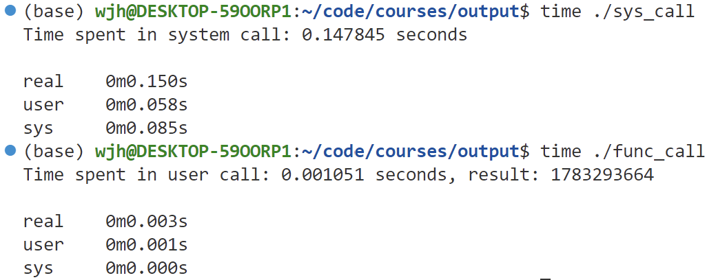
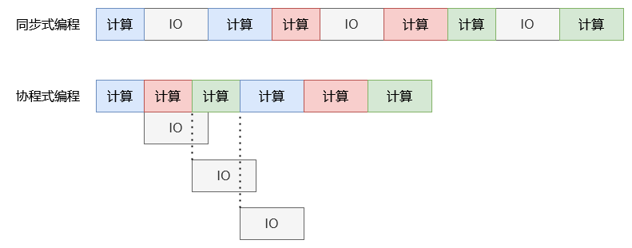

# 协程初探

## 协程初探

在学习 C++20 协程之前，我们有必要对协程这一编程中的通用概念做一个全面的了解，**事实上协程在多种语言中均被广泛使用**，最经典的莫过于golang对协程的支持。接下来我们将会学习协程的概念以及适用场景。

### 知识点

- 进程与线程知识回顾
- 协程的定义及适用场景

### 实验环境

- ubuntu22.04

## 认识协程

在我们学习计算机操作系统的时候，进程和线程是最基本也是最重要的概念之一，**而协程又与二者紧密相连**，因此在学习协程前我们简要回顾进程与线程的概念。

### 进程与线程

在我们学习计算机操作系统的时候，进程和线程是最基本也是最重要的概念之一。编写好的程序在编译后被存储为二进制格式文件，在运行时被加载到内存中，而这个运行时的程序也被称为进程。操作系统通过调度机制调配各个进程的状态，从而达到多个进程同时运行的效果。

进程的切换主要涉及如下步骤：

- **上下文保存**：操作系统保存当前进程的上下文信息，如程序计数器、寄存器、栈指针、内存映射信息等，这些信息被存储在操作系统内核的进程控制块 PCB 中。
- **选择目标进程**：操作系统根据调度算法选择即将切换到的新进程。
- **加载目标进程上下文**：操作系统从目标进程对应的 PCB 中恢复进程上下文信息。

早期的操作系统中都是以进程作为独立运行的基本单位，后来又诞生了更小的能独立运行的基本单位，也就是线程。相比进程线程具有更轻量的切换过程，其切换步骤与进程类似，但线程之间共享内存等数据，因此涉及到的上下文信息更少（主要是寄存器和线程栈），并且由于资源共享，线程的创建开销也更小。

不论是进程还是线程，其切换均需要系统调用，即操作系统需要陷入内核态再返回用户态。而系统调用是一种昂贵的操作，在对性有较高要求的场景下应该尽可能减少系统调用的次数。

#### 💻系统调用实验

我们可以利用 getpid() 这个 linux 下简单的系统调用做个实验测试系统调用的损耗，代码如下：

```c
// sys_call.c
#include <stdio.h>
#include <time.h>
#include <unistd.h>

int main()
{
  struct timespec start, end;
  clock_gettime(CLOCK_MONOTONIC, &start);

  for (int i = 0; i < 1000000; i++)
  {
    getpid();
  }

  clock_gettime(CLOCK_MONOTONIC, &end);

  double time_spent = (end.tv_sec - start.tv_sec) + (end.tv_nsec - start.tv_nsec) / 1e9;
  printf("Time spent in system call: %f seconds\n", time_spent);

  return 0;
}
```

作为对照实验我们将循环内的代码替换为普通函数调用，因为 getpid() 这个函数十分简单，所以普通函数只执行加法计算即可。

```c
// func_call.c
#include <stdio.h>
#include <time.h>
#include <unistd.h>

int add(int x, int y)
{
  return x + y;
}

int main()
{
  struct timespec start, end;
  clock_gettime(CLOCK_MONOTONIC, &start);

  unsigned long long sum = 0;
  for (int i = 0; i < 1000000; i++)
  {
    sum = add(sum, i);
  }

  clock_gettime(CLOCK_MONOTONIC, &end);

  double time_spent = (end.tv_sec - start.tv_sec) + (end.tv_nsec - start.tv_nsec) / 1e9;
  printf("Time spent in user call: %f seconds, result: %lld\n", time_spent, sum);

  return 0;
}
```

我们利用 linux 下的`time`指令测算程序执行时间，结果如下所示：



可以看到即便是简单的系统调用相比普通函数也要多花费几十倍的时间，getpid() 的每次调用大概花费 1 微秒，而涉及到 I/O 相关的系统调用如 read() 或 write()，耗时可能会更长，因此在不必要的情况下程序应尽可能减少系统调用次数。

### 了解协程

协程（coroutine）与进程和线程一样是一种用于构建并发程序的计算结构（具体来说是一种可以在执行过程中切出并在需要时恢复运行的函数）但提供了一种更轻量级的并发编程方式。我们可以简单理解为协程是一种**用户态线程**，我们可以像编写多线程程序一样通过创建多个协程来执行多个任务，而操作系统是无法感知协程的存在的，所以协程的调度需要程序员控制，但需要注意协程仍然是依托在线程之上运行的，协程与线程的比例可以是 1:1、n:1 或者 n:m，下图演示了这种关系：


除了调度上的高效外，协程相比进程和线程的优点可归纳为如下：

- 协程的创建，销毁和调度都发生在用户态，避免 CPU 频繁切换带来的资源浪费。
- 内存占用小，可以轻松创建几十万的协程。
- 可读性高，易维护，代码基本等同于同步 (后续章节演示)。

下面的表格对三者进行了对比。

|  名称 | 进程   |  线程  |  协程 |
|:-----:|------:|--------:|-----:|
|地址空间 | 独有 | 共享 | 共享 |
|调度器  | 内核 | 内核 | 用户 |
|内存占用 | MB 级 | MB 级 | 几 kB |
|切换过程 | 陷入内核态 | 陷入内核态 | 保持用户态 |
|切换存储 | 内核栈 | 内核栈 | 用户栈 |
|切换内容 | 内存空间、栈指针、寄存器 | 栈指针、寄存器 |    寄存器 |
|切换效率 | 低 | 中 | 高 |

#### 💻切换实验：进程 VS 线程 VS 协程

由于进程和线程的切换涉及诸多因素，想要精准测算二者的切换时间难度较大，但依据实际经验基本都是在微秒级别，本次实验我们可以简易测试下协程的切换速度，linux 下的 ucontext 库（后续详细介绍）可以帮助我们模拟协程切换，代码如下：

```cpp
#include <ucontext.h>
#include <unistd.h>
#include <stdio.h>
#include <time.h>
#include <iostream>

int main()
{
  struct timespec start, end;
  clock_gettime(CLOCK_MONOTONIC, &start);

  int idx = 0;
  ucontext_t ctx1;
  getcontext(&ctx1);

  idx++;
  if (idx == 1)
  {
    setcontext(&ctx1);
  }
  clock_gettime(CLOCK_MONOTONIC, &end);

  double time_spent = (end.tv_sec - start.tv_sec) + (end.tv_nsec - start.tv_nsec) / 1e9;
  std::cout << "Ucontext switch time: " << time_spent << " seconds" << std::endl;
  return 0;
}

```

本地运行结果如下表格所示，抛开不相干指令的影响协程切换应该是不足 1 微秒的。

| | 时间（s）|
|--:|--:|
|1|2.311e-06|
|2|1.14e-06|
|3|2.42e-06|
|4|2.322e-06|
|5|1.182e-06|
|6|1.053e-06|
|7|2.463e-06|
|8|8.81e-07|
|9|8.42e-07|
|10|2.595e-06|
|avg|1.72e-06|

### 协程使用场景

在了解协程使用场景前，我们需要知道在无协程的编程模式下存在什么问题。主要是针对 IO 密集型应用，如果是同步阻塞 IO，那么线程会在等待 IO 时被阻塞，这个过程可能会发生线程切换，如果是同步非阻塞 IO，线程也会因为轮询 IO 是否完成而浪费 CPU 资源，总之传统的同步 IO 效率非常底下。

解决该问题的办法之一是使用异步 IO，如 asio 库，通过对 IO 注册回调函数来降低因等待 IO 造成的性能损耗，但是为了实现某些逻辑经常会写出层层嵌套的回调函数，如果嵌套过多，会极大影响代码可读性和逻辑，这种情况也被成为回调地狱，同时过度使用回调也会大大降低代码可读性和可维护性。

所以异步 IO 也不能很好的处理 IO 密集型应用吗？答案是否定的，虽然回调函数式的异步 IO 存在诸多缺陷，但异步 IO 一定需要回调函数吗？显然不是。在 Linux 5.1 版本引入的 io_uring 作为一种高效异步 IO 框架，它通过减少系统调用和内存拷贝，提供更低的延迟和更高的吞吐量，其调用形式类似于 linux 下的 epoll，但与 epoll 相比 io_uring 开销更低，后续我们会详细介绍。

使用 io_uring 处理 IO 时线程仍然需要轮询完成队列或者被阻塞，这样并不高效，聪明的读者此时已经想到了利用协程搭配 io_uring 来处理 IO 密集型应用。通过使用协程向 io_uring 提交 IO 任务，再利用高效的协程切换去执行下一个任务，在高并发 IO 密集场景下程序几乎不会在等待 IO 上浪费资源，下图给出了演示：



有读者可能觉得 IO 多路复用（epoll）搭配线程池也可以解决 IO 难题，这确实是一种很好的思路，但在之后的协程实践中我们会发现使用协程编写的代码更加简洁，尤其是在上述演示中可以轻松将一个任务的计算任务和 IO 任务分离开来，综合来看协程其实是一种通用的解决方案，在计算与 IO 混合的应用场景下仍然保持较高的性能。

## 实验总结

本节带领读者从概念上入门协程，理解协程的诞生背景以及所解决的问题，后续我们会深入 C++20 协程来进行协程实践。
