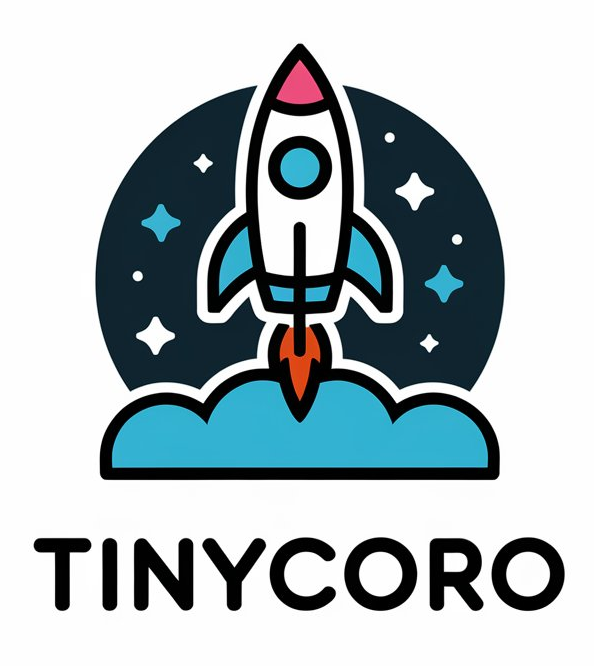
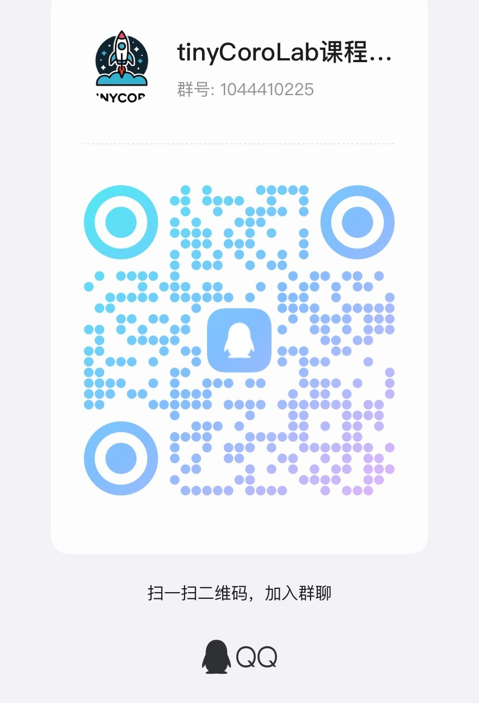

  

-----------------

# 欢迎加入tinyCoroLab

## tinyCoro介绍

[tinyCoroLab](https://github.com/sakurs2/tinyCoroLab)是一门以[tinyCoro](https://github.com/sakurs2/tinyCoro)为基础的实验课程，而[tinyCoro](https://github.com/sakurs2/tinyCoro)是一个linux系统环境下的以**C++20协程技术和linux io_uring技术相结合**的高性能异步协程库。高效且全能的io_uring和C++20无栈协程的轻量级切换相组合使得[tinyCoro](https://github.com/sakurs2/tinyCoro)可以轻松应对I/O密集型负载，而C++20协程的特性使得用户可以以同步的方式编写异步执行的代码，大大降低了后期维护的工作量，且代码逻辑非常简单且清晰，除此外**tinyCoro还提供了协程安全组件，以协程suspend代替线程阻塞便于用户构建协程安全且高效的代码。**

经过测试由[tinyCoro](https://github.com/sakurs2/tinyCoro)实现的echo server在1kbyte负载和100个并发连接下可达到100wQPS，关于[tinyCoro](https://github.com/sakurs2/tinyCoro)更详细的信息请访问github主页。

## tinyCoroLab介绍

[tinyCoroLab](https://github.com/sakurs2/tinyCoroLab)的设计灵感来自于广为人知的CMU15445数据库内核实验和MIT6.824分布式实验，它们通过让学生编写指定接口的实现并通过大量的测试验证正确性来使得学生提高代码能力的同时学习到特定的领域知识，高难度的实验带来的是巨大的代码级和知识级的能力提升，这也使得这两门实验课程广受学生好评。而[tinyCoroLab](https://github.com/sakurs2/tinyCoroLab)沿袭这种设计思路，通过将[tinyCoro](https://github.com/sakurs2/tinyCoro)的实现拆分成多个子部分来构成5节实验课程，包括：

- **lab1:** 构建协程任务封装，包括lab1一个子实验
- **lab2:** 构建任务执行引擎，包括lab2a和lab2b两个子实验
- **lab3:** 封装异步I/O执行模块，包括lab3一个子实验
- **lab4:** 构建基础协程同步组件，包括lab4a，lab4b，lab4c，lab4d四个子实验
- **lab5:** 构建进阶协程同步组件，包括lab5a，lab5b，lab5c三个子实验

在上述实验的基础上[tinyCoroLab](https://github.com/sakurs2/tinyCoroLab)提供了200+项功能测试和内存安全测试来考察用户实现的功能逻辑正确性和内存安全性，并且lab4和lab5额外新增了性能测试通过googlebenchmark将基线模型与用户实现做对比来衡量用户实现的性能。除此之外[tinyCoroLab](https://github.com/sakurs2/tinyCoroLab)在cmake中定义了大量的指令来简化实验流程并提供一键生成perf性能分析火焰图的脚本，使得实验者可以专心于实现实验内容。

[tinyCoroLab](https://github.com/sakurs2/tinyCoroLab)并不像CMU15445和mit6.824课程那样涉及特定领域复杂的知识，因此难度稍弱，但其本身涉及到多线程下的高并发因此仍旧对实验者的代码能力仍有较强考验。[tinyCoroLab](https://github.com/sakurs2/tinyCoroLab)核心功能代码共计约2000行，测试加样例共计约4000行，而作为[tinyCoroLab](https://github.com/sakurs2/tinyCoroLab)的开源实现版本[tinyCoro](https://github.com/sakurs2/tinyCoro)在实验的基础上添加了约700行功能代码，因此实验者代码量预计在700行以下，耗时预计一个星期左右。

通过完成该实验，你将收获：

- **简历新增一个新颖、有技术含量且被深度量化过的项目。**
- **更加熟练的C++编程技巧，以及对C++新标准的应用。**
- **对强大的io_uring异步I/O技术的掌握。**
- **对多线程编程有更深入的理解。**

本实验学习了github开源且高star的C++项目的项目组织方式，如果你愿意研究该部分内容，你还将收获：

- **一个标准的通过cmake构建C++项目的方式。**
- **在项目中熟练运用单元测试、性能测试以及性能分析工具。**

扫描下方二维码加入tinyCoroLab课程交流qq群，任何问题都可向作者本人直接提问哦！

当然，你也可以通过我的邮箱<393814041@qq.com>直接与我联系！

快来开启属于你的tinyCoroLab之旅吧！

## 关于付费

在这里和各位同学说声抱歉，因为制作tinyCoroLab全套课程花费了我大量的精力，所以针对小部分**可替代性十分强**的文档采取了知识星球收费，但收费绝不是为了赚钱，仅仅是作为一点小回报吧。

付费文档包含以下部分：

- 对于开启tinyCoroLab的前置知识C++协程和liburing的讲解，因为知识点很庞大，所以我按照自己的理解精心制作了多篇文档来帮助大家理解。**免费用户可以选择阅读我精心整理的优质开源博客。**
- 对于tinyCoroLab的每一项实验我都会根据tinyCoro的代码为大家讲解如何实现，该部分正在制作中。**免费用户可以选择阅读tinyCoro开源代码。**
- 在番外杂谈部分我会持续分享一些我在工作中遇到一些有趣的知识点。

通过下图方式加入知识星球：

> 知识星球收费强制最低50元，而tinyCoroLab收费文档价格为30，扣除20%的手续费，因此用户在加入后请私聊星主返现10元。

