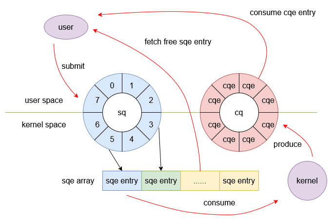

# 认识io_uring

## 认识io_uring

io_uring作为linux系统下的异步I/O接口，自2019年发布，经过不断地更新迭代已经逐步成熟可用。相信各位读者之前也接触过各种各样的I/O模型，比如网络编程常用的多路复用epoll以及异步编程库aio，且上述I/O模型因为优异的性能已经得到广泛应用，那么为什么linux系统还要再设计出另一套异步I/O接口io_uring呢？本节将会基于这个问题带读者认识并掌握这种强大的异步I/O技术。

#### 知识点

- io_uring诞生背景及设计原理
- io_uring核心系统API
- liburing编程实战

## linux下传统IO的缺陷

对于最为基础的同步I/O其缺陷不言而喻，线程需要阻塞等待结果返回，这在I/O密集型应用中会产生严重的性能低下问题。

对于多路复用I/O的代表epoll，它能显著提高程序在大量并发连接中只有少量活跃的情况下的系统CPU利用率，在网络编程领域占据了重要地位，但其存在一个致命缺陷：只支持network sockets和pipes，甚至连基础存储文件的I/O都不支持。

linux下还存在另一种高效的异步I/O模型——aio，其原理是用户使用`io_submit()`提交I/O请求，再调用`io_getevents()`来查看哪些请求已经完成，这样使得用户可以编写异步执行的代码，而且支持的I/O类型不仅有网络I/O还包括文件存储I/O。但是aio仍然存在一些缺陷：

- 只支持O_DIRECT文件。
- 并非完全非阻塞，在某些情况下会出现接口阻塞的行为且难以预料。
- 接口拓展性较差。

综上可以看出linux系统下虽然存在众多I/O模型，但均会有各种缺陷限制其使用场景，因此linux迫切需要一种新的I/O模型来解决这些问题。

## 初识io_uring

io_uring的设计目标是提供一个统一、易用、可扩展、功能丰富、高效的网络和磁盘系统接口，作为io_uring的开发者Jens Axboe在长时间对Linux I/O stack的研究中得出了一个结论：随着基础存储设备速度的提升，中断驱动模式的效率已经低于轮询模式。因此io_uring的基本逻辑与aio类似，同样为用户提供提交I/O的接口和接收完成事件的接口，但其内核设计与aio完全不同：

- io_uring是真正异步的，调用其接口仅仅是与内核数据结构做一次交互，绝对不会像aio一样发生预期外的阻塞。
- 支持任意类型的I/O。
- 交互逻辑简单，用户仅需要提交I/O，完成之后I/O事件会自动出现在完成队列里。
- 接口灵活、可拓展性强。基于io_uring甚至能重写linux下的系统调用。

相比其他I/O模型，io_uring具有明显的优势。它通过用户态和内核态共享提交队列（Submission Queue）和完成队列（Completion Queue），减少了系统调用的次数和上下文切换的开销。在io_uring中，应用程序只需将I/O请求放入提交队列，内核会在后台处理这些请求，并将结果放入完成队列，应用程序可以随时从完成队列中获取结果，无需频繁进行系统调用和轮询。此外，io_uring支持更多的异步系统调用，不仅适用于存储文件的 I/O 操作，还能很好地应用于网络套接字的I/O处理，具有更广泛的适用性和更高的灵活性。

综合来看io_uring更像是一个六边形战士，担负着大一统linux下I/O编程的重任，不过其性能相比aio并不会有巨大的提升，但其广泛的io支持和灵活的拓展性对于实际开发是非常重要的。

## io_uring实现原理

io_uring实现异步I/O的本质是利用了一个生产者-消费者模型，每个uring在初始化时会在内核中创建提交队列（sq）和完成队列（cq），其数据结构均为固定长度的环形缓冲区。用户向sq提交I/O任务，内核负责消费任务，完成后的任务会被放至cq中由用户取出，为了降低用户态与内核态之间的数据拷贝，io_uring使用mmap让用户和内核共享sq与cq的内存空间。具体可以看下图所示：



从图中可以看出核心数据并不存储在sq中，而是存储在sqe array中，sqe array包含多个sqe entry（sqe），每个sqe是一个结构体存储了I/O请求的详细信息，比如操作类型、缓冲区地址、缓冲区长度和文件描述符等等，sq只存储索引项，用户操作的完整流程包含如下步骤：

- 用户调用接口获取空闲的sqe entry并填充I/O信息。
- 用户向sq提交sqe，sq记录其索引信息。
- 内核从sq获取sqe entry并处理，完成后将结果封装成cqe entry放入cq中，cqe entry存储了I/O操作的结果。
- 用户从cq中获取cqe entry，处理结束后标记该cqe entry，这样相关联的sqe entry回到空闲状态等待再利用。

io_uring的核心系统API有如下三个：

### `io_uring_setup`

```cpp
SYSCALL_DEFINE2(io_uring_setup, u32, entries,struct io_uring_params __user *,params)                                                                                                                                                           
{
        return io_uring_setup(entries, params);
}
```

- **功能**：创建io_uring实例。
- **参数entries**：用户期望的完成队列的大小，即队列可容纳I/O请求的数量。
- **参数params**： 一个指向io_uring_params结构体的指针，该结构体用于返回io_uring实例的相关参数，如实际分配的 SQ 和完成队列（CQ）的大小、队列的偏移量等信息。
- **返回**：io_uring实例的文件描述符。

用户在使用io_uring前需要调用`io_uring_setup`接口创建io_uring实例，内核会根据参数为其分配内存空间，成功后会返回与该io_uring绑定的文件描述符，后续操作均基于该文件描述符。

### `io_uring_enter`

```cpp
SYSCALL_DEFINE6(io_uring_enter, unsigned int, fd, 
                                u32, to_submit,
                                u32, min_complete, 
                                u32, flags, 
                                const void __user *, argp,size_t, argsz)
```

- 功能：提交I/O以及等待I/O操作完成。
- 参数fd：io_uring实例对应的文件描述符。
- 参数to_submit：用户准备提交的I/O请求的数量。
- 参数min_complete：函数在返回前至少要完成的I/O请求数量。
- 参数flags：用于控制io_uring_enter的行为。

一般用户通过`io_uring_submit`函数提交I/O请求，而该函数内部实现正是通过`io_uring_enter`。

### `io_uring_register`

```cpp
SYSCALL_DEFINE4(io_uring_register, 
                unsigned int, fd, 
                unsigned int, opcode,
                void __user *, arg, unsigned int, nr_args)
```

- 功能：用于注册文件描述符、缓冲区、事件文件描述符等资源到io_uring。
- 参数fd：io_uring实例对应的文件描述符。
- 参数opcode：表示注册的类型。
- 参数arg：指针指向与opcode相关联的内容。

通过`io_uring_register`注册文件描述符或缓冲区等资源后，内核在处理I/O请求时，可以直接访问这些预先注册的资源，而无需每次都重新设置相关信息，从而提高了I/O操作的效率。例如，在进行大量文件读写操作时，预先注册文件描述符可以避免每次提交I/O请求时都进行文件描述符的查找和验证，减少了系统开销，提升了I/O性能。

> 💡**每次提交I/O前进行系统调用会不会很影响性能？**
> 答案是会的，而io_uring的设计者也考虑到了这一点，用户可以在初始化io_uring实例时添加`IORING_SETUP_SQPOLL`这个flag，这样内核会额外启动一个sq线程自动去poll请求队列，此时用户调用`io_uring_submit`并不会涉及到系统调用，也就是不会调用`io_uring_enter`，这样减少系统调用次数来提高效率，不过为了防止sq线程在poll的过程中导致系统cpu占用过高，因此在指定时间后如果没有任何请求，那么sq线程会陷入休眠状态，此时需要调用`io_uring_enter`来唤醒sq线程。

## liburing实战

虽然io_uring的核心系统API只有3个，但想要用好还是有一定难度的，而大佬们也考虑到了这一点，在io_uring接口的基础上进行二次封装开发了liburing，而我们后续实验将会基于liburing进行开发，因此本小节将带大家通过liburing提供的接口使用io_uring，用户需要在linux内核的操作系统（wsl、虚拟机均可）下进行本节操作。

首先克隆最新的liburing项目：

```shell
git clone https://github.com/axboe/liburing.git
```

编译并安装：

```shell
cd liburing
./configure --cc=gcc --cxx=g++;
make -j$(nproc);
make liburing.pc
sudo make install;
```

下面给出用liburing实现echo server的样例程序：

```cpp
// echo_server.cpp
#include <liburing.h>
#include <netinet/in.h>
#include <stdio.h>
#include <string.h>
#include <unistd.h>

#define EVENT_ACCEPT 0
#define EVENT_READ 1
#define EVENT_WRITE 2

struct conn_info
{
  int fd;
  int event;
};

int init_server(unsigned short port)
{
  int sockfd = socket(AF_INET, SOCK_STREAM, 0);
  struct sockaddr_in serveraddr;
  memset(&serveraddr, 0, sizeof(struct sockaddr_in));
  serveraddr.sin_family = AF_INET;
  serveraddr.sin_addr.s_addr = htonl(INADDR_ANY);
  serveraddr.sin_port = htons(port);

  if (-1 == bind(sockfd, (struct sockaddr *)&serveraddr, sizeof(struct sockaddr)))
  {
    perror("bind");
    return -1;
  }

  listen(sockfd, 10);

  return sockfd;
}

#define ENTRIES_LENGTH 1024
#define BUFFER_LENGTH 1024

void set_event_recv(struct io_uring *ring, int sockfd, void *buf, size_t len, int flags)
{
  struct io_uring_sqe *sqe = io_uring_get_sqe(ring);

  struct conn_info accept_info = {
      .fd = sockfd,
      .event = EVENT_READ,
  };

  io_uring_prep_recv(sqe, sockfd, buf, len, flags); // 为sqe entry填充读事件所需的相关数据
  memcpy(&sqe->user_data, &accept_info, sizeof(struct conn_info));
}

void set_event_send(struct io_uring *ring, int sockfd, void *buf, size_t len, int flags)
{
  struct io_uring_sqe *sqe = io_uring_get_sqe(ring);

  struct conn_info accept_info = {
      .fd = sockfd,
      .event = EVENT_WRITE,
  };

  io_uring_prep_send(sqe, sockfd, buf, len, flags); // 为sqe entry填充写事件所需的相关数据
  memcpy(&sqe->user_data, &accept_info, sizeof(struct conn_info));
}

void set_event_accept(struct io_uring *ring, int sockfd, struct sockaddr *addr, socklen_t *addrlen, int flags)
{
  struct io_uring_sqe *sqe = io_uring_get_sqe(ring);

  struct conn_info accept_info = {
      .fd = sockfd,
      .event = EVENT_ACCEPT,
  };

  io_uring_prep_accept(sqe, sockfd, (struct sockaddr *)addr, addrlen, flags); // 为sqe entry填充连接事件所需的相关数据
  memcpy(&sqe->user_data, &accept_info, sizeof(struct conn_info));
}

int main(int argc, char *argv[])
{
  unsigned short port = 8000;
  int sockfd = init_server(port);

  struct io_uring_params params;
  memset(&params, 0, sizeof(params));

  struct io_uring ring;
  io_uring_queue_init_params(ENTRIES_LENGTH, &ring, &params); // 根据参数初始化io_uring实例

  struct sockaddr_in clientaddr;
  socklen_t len = sizeof(clientaddr);
  set_event_accept(&ring, sockfd, (struct sockaddr *)&clientaddr, &len, 0);

  char buffer[BUFFER_LENGTH] = {0};

  while (1)
  {
    io_uring_submit(&ring); // 提交I/O请求

    struct io_uring_cqe *cqe;
    io_uring_wait_cqe(&ring, &cqe); // 等待至少一个完成事件

    struct io_uring_cqe *cqes[128];
    int nready = io_uring_peek_batch_cqe(&ring, cqes, 128); // 批量获取完成事件

    int i = 0;
    for (i = 0; i < nready; i++)
    {
      struct io_uring_cqe *entries = cqes[i];
      struct conn_info result;
      memcpy(&result, &entries->user_data, sizeof(struct conn_info));
      if (result.event == EVENT_ACCEPT)
      {
        set_event_accept(&ring, sockfd, (struct sockaddr *)&clientaddr, &len, 0);
        int connfd = entries->res;
        set_event_recv(&ring, connfd, buffer, BUFFER_LENGTH, 0);
      }
      else if (result.event == EVENT_READ)
      {
        int ret = entries->res;
        if (ret == 0)
        {
          close(result.fd);
        }
        else if (ret > 0)
        {
          set_event_send(&ring, result.fd, buffer, ret, 0);
        }
      }
      else if (result.event == EVENT_WRITE)
      {
        int ret = entries->res;
        set_event_recv(&ring, result.fd, buffer, BUFFER_LENGTH, 0);
      }
    }
    io_uring_cq_advance(&ring, nready); // 批量标记完成事件，使得关联的sqe可以被重新使用
  }
  return 0;
}
```

编译并运行该程序：

```shell
g++ echo_server.cpp -luring -o echo_server
./echo_server
```

此时读者可以使用`nc 127.0.0.1 8000`命令来与该服务器通信测试liburing是否工作正常。

<!-- TODO: 添加eventfd的内容 -->
对于样例程序涉及到的liburing的接口均添加了注释，

liburing的接口数量众多，很难也没必要一一拿出来讲解，用户可以在`liburing.h`中进行查看各个接口，这里为大家推荐两个官方网站用于大家更深入的了解liburing：

- [Lord of the io_uring](https://unixism.net/loti/index.html)：官方提供的用于介绍io_uring和liburing的网站，里面提供了io_uring的设计思路以及用liburing实现的各个样例程序，并且还讲解了liburing的核心接口。
- [Linux man pages](https://man7.org/linux/man-pages/index.html)：liburing涉及的API用户均可在该网站上查找使用说明。


## liburing结合eventfd

liburing允许`io_uring`实例与eventfd绑定，那么什么是eventfd呢？

eventfd是linux下的轻量级的用于事件通知的文件描述符，使用方法包含下列两个读写接口以及初始化接口：

```cpp
#include <sys/eventfd.h>
/* Return file descriptor for generic event channel.  Set initial
   value to COUNT.  */
extern int eventfd (unsigned int __count, int __flags) __THROW;
/* Read event counter and possibly wait for events.  */
extern int eventfd_read (int __fd, eventfd_t *__value);
/* Increment event counter.  */
extern int eventfd_write (int __fd, eventfd_t __value);
```

eventfd实现的逻辑是累计计数，当计数为0则读操作阻塞，否则读取的是当前的计数值并将eventfd的计数清0。写操作是不会阻塞的，但写入的值并不会直接作为eventfd的计数，而是以累加到原本计数的方式存储。这样就可以实现事件通知机制了，之所以称为轻量级是因为对eventfd的操作基本在1us左右。

调用下列函数来将`io_uring`与eventfd绑定。

```cpp
int io_uring_register_eventfd(struct io_uring *ring, int event_fd);
```

当`io_uring`产生IO完成事件时会向eventfd写入值，那么这个写入值有啥含义呢？我们可以看下面一段实战代码：

```cpp
// main.cpp
// g++ main.cpp -o main -luring
#include <stdio.h>
#include <stdlib.h>
#include <unistd.h>
#include <liburing.h>
#include <sys/eventfd.h>

int main()
{
  struct io_uring ring;
  int m_efd = eventfd(0, 0);

  if (io_uring_queue_init(16, &ring, 0) != 0)
  {
    perror("io_uring_queue_init");
    return 1;
  }

  if (io_uring_register_eventfd(&ring, m_efd) != 0)
  {
    perror("io_uring_register_eventfd");
    return 1;
  }

  // 提交多个 NOP 操作，NOP会在提交后立刻产生cqe
  for (int i = 0; i < 10; i++)
  {
    struct io_uring_sqe *sqe = io_uring_get_sqe(&ring);
    io_uring_prep_nop(sqe);
    io_uring_submit(&ring);
  }

  // 等待 eventfd 通知
  uint64_t events;
  if (read(m_efd, &events, sizeof(events)) < 0)
  {
    perror("read eventfd");
    return 1;
  }
  printf("Received %llu events\n", events);

  // 清理
  io_uring_queue_exit(&ring);
  close(m_efd);
  return 0;
}
```

此时打印出的从eventfd读出来的数字是多少？正确答案是10，那是不是这个值表示当前`io_uring`内的cqe数量呢？对上面的代码稍作修改：

```cpp
// 提交多个 NOP 操作，NOP会在提交后立刻产生cqe
for (int i = 0; i < 10; i++)
{
  struct io_uring_sqe *sqe = io_uring_get_sqe(&ring);
  io_uring_prep_nop(sqe);
  // io_uring_submit(&ring);
}
io_uring_submit(&ring);
```

此时打印出的从eventfd读出来的数字又是多少？答案是1，因为修改后的代码的提交属于批量提交，批量提交属于`io_uring`的特性，因此从eventfd读出来值反映出的是完成的批次数。

不管怎样，只要从eventfd读出值，不用管值大小，此时一定是存在cqe的，只需要取出来处理就好，通过将liburing搭配eventfd，我们便能实现类似epoll的事件循环机制。

## 参考文献

- [解密高性能异步I/O：io_uring的魔力与应用](https://zhuanlan.zhihu.com/p/21039819177)

## 实验总结

本文为大家讲解了io_uring的诞生背景即它解决了什么问题，随后讲解了io_uring的核心实现原理并介绍其三个核心系统API，最后介绍liburing并给出实战程序讲解，至此tinyCoroLab的前置铺垫知识全部结束，后续我们将正式开始tinyCoroLab实战。
