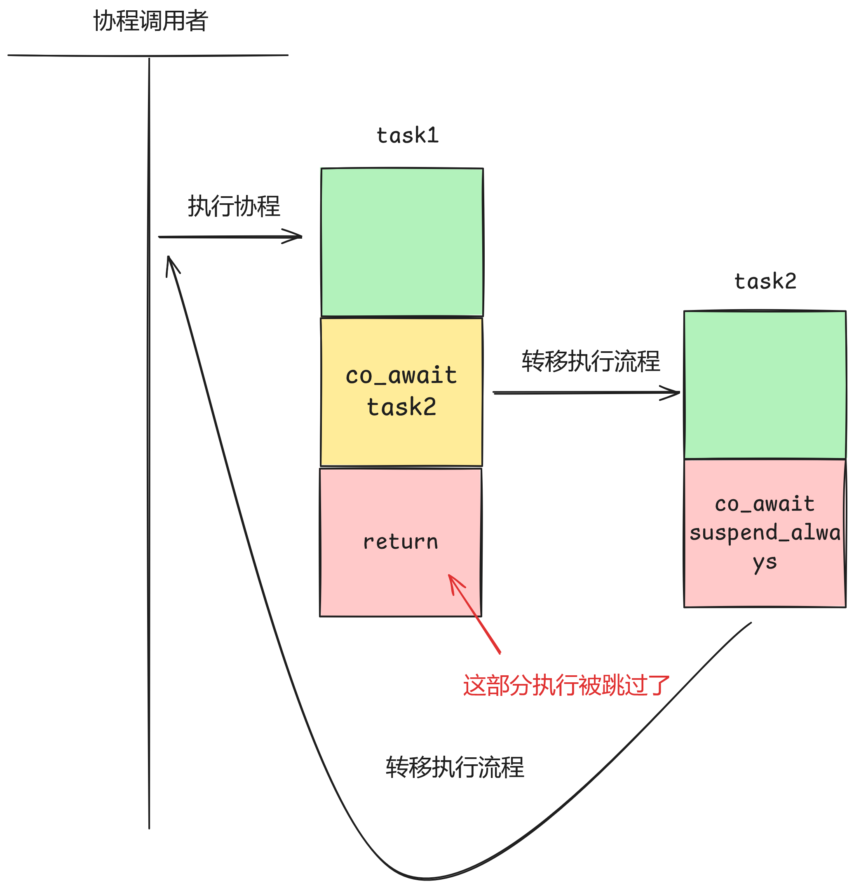

# tinyCoroLab1: 构建协程任务封装

## tinyCoroLab1实验简介

本节我们将正式开始tinyCoroLab1，即构建协程任务封装模块。对于tinyCoro所有的任务都会被封装成协程函数并由执行引擎执行，因此构建tinyCoro的第一步便是完成由协程作为底层支持的任务基本单元task的实现。

#### 预备知识

> ⚠️预备知识即在实验开始前你应该已经掌握的知识，且在[知识铺垫章节]()中均有涉及

- **C++20协程概念及使用**

## 📖lab1任务书

### 实验前置讲解

本节实验涉及到的文件为[include/coro/task.hpp](https://github.com/sakurs2/tinyCoroLab/blob/v1.0/include/coro/task.hpp)，实验者需要预先打开文件浏览大致代码结构，下面针对该文件内容进行讲解。

promise_base为task定义了task创建以及结束时的调度逻辑，分别由`initial_suspend()`和`final_suspend()`实现。`initial_suspend()`必须返回`std::suspend_always`，因为创建task后不能立即执行，必须交由执行引擎执行而不是创建者，而`final_suspend()`则交由实验者实现。

与task绑定的promise定义如下，因为task可以带有返回值所以需要添加一个模板参数指定返回值，同时继承promise_base的调度逻辑，并且通过继承container来实现暂存返回值。

```cpp
template<typename return_type>
struct promise final : public promise_base, public container<return_type>
```

对于返回值为空的task不需要继承container且C++协程对于返回值为空的情况也需要额外处理，因此特化一个模板参数为空的promise，对于熟悉C++20协程的同学来说这是很常规的操作。

```cpp
template<>
struct promise<void> : public promise_base
```

> 💡**为何需要额外定义promise_base？**
> 因为C++协程规定对于协程返回值是否为空编译器需要调用不同的函数，因此通常与协程关联的promise都会额外特化一个返回值模板参数为空的实现，而对于tinyCoro的task返回值是否为空不影响协程调度逻辑，因此抽取共性部分单独作为一个类来减少冗余代码。

对于task的定义不再做过多详细介绍，因为都是常规的协程实现，不过需要注意**当task内部co_await另一个task后子task会立刻执行，tinyCoro对于task的设计是只有当task创建或者co_await特定的awaiter时才会陷入suspend状态**，这一设计的作用会在后续实验中体现。

> 💡**为何task没有支持yield？**
> 现有的功能场景下yield并没有什么作用，比较鸡肋就不再实现，当然实验者可以自行拓展。

如果实验者不理解上述讲解的内容可以查看前几章的[C++协程入门教程]()来学习铺垫知识。作为tinyCoroLab的开篇实验，lab1难度设计较低，实验者仅需要在现有task的基础上完成一些子功能即可。

### ⚠️注意事项

- 请确保已阅读过**tinyCoroLab Introduce**章节。
- 为了确保正确实现目标函数，实验者可能需要做一些额外操作：新增类、修改现有类的实现、补充现有类的方法和成员变量等操作，请遵循**free-design实验原则**。

### 实验任务书

#### 🧑‍💻Task #1 - 实现task执行结束后的正确调度逻辑

##### 任务目标

前述小节提到过task运行结束后的调度逻辑是通过promise_base的`final_suspend()`函数实现的，对于简单执行的协程仅仅返回`std::suspend_always`即可，但这样会出现什么问题呢？下图给出了演示：



不难看出task1的部分执行逻辑被跳过了，正确的做法是task2在执行结束后将执行权转移给task1而不是main，因此tinyCoro的task应当在被嵌套调用的情况下记录父级task的handle以便执行结束后利用该handle转移执行权。该功能主要由实验者在`final_suspend()`中负责实现。

##### 涉及文件

- [include/coro/task.hpp](https://github.com/sakurs2/tinyCoroLab/blob/v1.0/include/coro/task.hpp)

##### 待实现函数

- `coro::detail::promise_base::final_suspend()`

#### Task #2 - 为task添加detach状态

对C++协程编程较为熟悉的同学都知道，协程资源是需要外部调用函数主动进行释放的，如果没有及时释放会导致内存泄露的问题，对此一种通用解决方案是使用RAII的技巧来保管协程句柄，比如tinyCoro中的task会在析构时自动释放协程资源。

但是执行引擎是不会感知到task的存在的，向执行引擎提交task本质上是在提交task所持有的协程句柄。如果向执行引擎提交的是右值语义的task，执行引擎会在获取task持有的协程句柄后调用`task.detach()`来使task处于detach状态，即task不再保管该协程句柄，如果外部想继续获取只会得到空句柄。

执行引擎让task处于detach状态也可以理解为将协程资源释放义务从task转移到执行引擎，当执行引擎将协程任务执行完毕后会调用`clean()`来释放协程资源，而clean函数需要根据入参协程句柄来判断该协程是否为detach状态，如果是detach状态，那么释放协程资源，否则就不执行任何逻辑，因为非detach状态的协程句柄此时一定是被某个task保管。

上述提到的`detach()`和`clean()`均需要由实验者实现。

> 💡**如果向执行引擎提交了左值类型的task，随后task生命周期结束释放了协程句柄的资源，那么稍后执行引擎执行该协程岂不是会出现core dump？**
> 是的，关于资源释放的问题可以有很复杂的情况，tinyCoro在这方面并没有很完善，不过实验的测试程序不会涉及到这种case，测试和实际使用基本都是以右值的形式提交task。

##### 涉及文件

- [include/coro/task.hpp](https://github.com/sakurs2/tinyCoroLab/blob/v1.0/include/coro/task.hpp)

##### 待实现函数

- `coro::task::detach()`
- `coro::clean(std::coroutine_handle<> handle)`

### 🔖测试

#### 功能测试

功能测试场景主要针对：

- **task的正常执行**
- **task的嵌套执行**
- **task的移动语义**
- **协程资源的正确释放**

完成本节实验后，实验者请在构建目录下执行下列指令来构建以及运行测试程序：

```shell
make build-lab1 # 构建
make test-lab1 # 运行
```

#### 内存安全测试

在构建目录下运行下列指令来执行内存安全测试：

```shell
make memtest-lab1
```

测试通过会提示pass，不通过会给出valgrind的输出文件位置，请实验者根据该文件排查内存故障。
