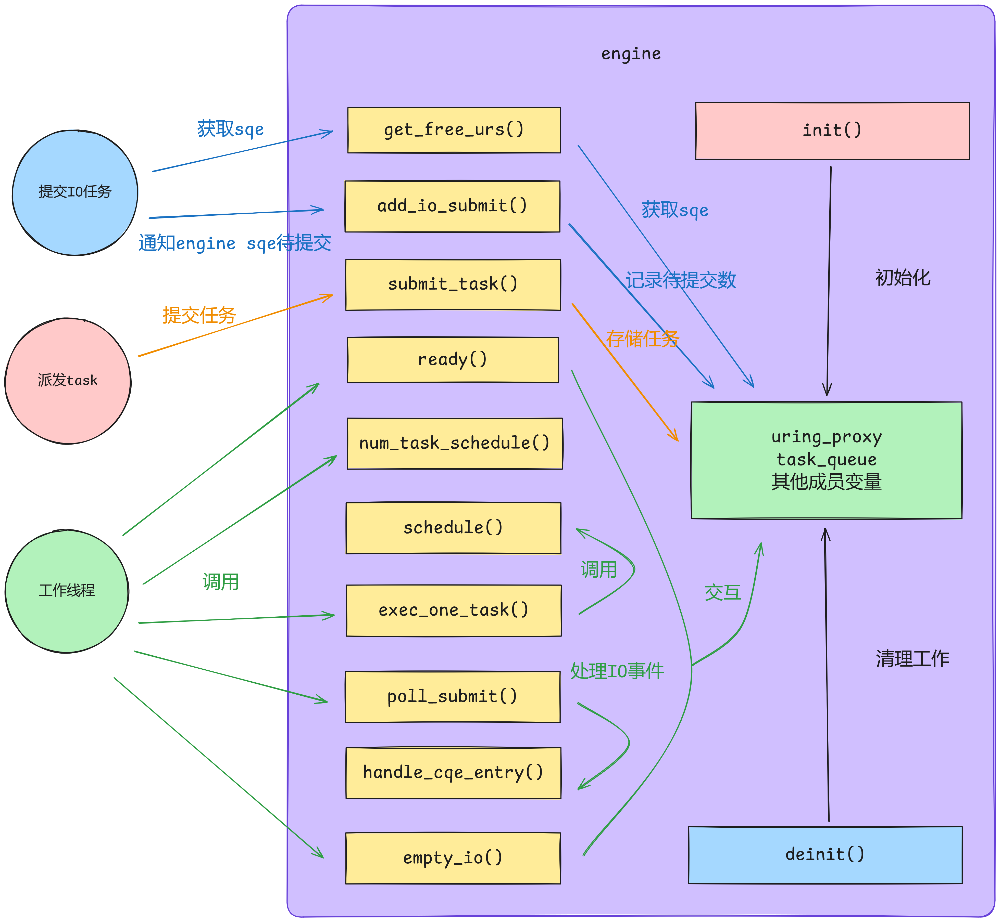

# tinyCoroLab2a: 构建任务执行引擎engine

## tinyCoroLab2a实验简介

本节我们将正式开始tinyCoroLab2a，即构建任务执行引擎的子模块engine。tinyCoro的执行引擎是由context和engine两部分组成的，engine作为执行引擎的核心部分，负责存储并执行所有task以及异步I/O，因此要想让tinyCoro真正对外提供服务的第一步便是完成engine的实现。

> 💡**怎么去理解context和engine？**
> 这里做一个比喻，把执行引擎看做战场的士兵，task是待执行的任务，那么engine便是士兵手里的武器，context则是士兵本人，一个士兵配备一把武器，只有装备了武器的士兵才能去执行任务，而后续的scheduler可以看作是司令官，负责收集士兵传递的情报并向士兵派发任务。

#### 预备知识

> ⚠️预备知识即在实验开始前你应该已经掌握的知识，且在[知识铺垫章节]()中均有涉及

- **io_uring的概念以及liburing的使用**
- **eventfd的概念及使用**
- **C++协程句柄的使用**

## 📖lab2a任务书

### 实验前置讲解

本节实验涉及到的核心文件为[include/coro/engine.hpp](https://github.com/sakurs2/tinyCoroLab/blob/v1.0/include/coro/engine.hpp)和[src/engine.cpp](https://github.com/sakurs2/tinyCoroLab/blob/v1.0/src/engine.cpp)，实验者需要预先打开文件浏览大致代码结构，下面针对该文件内容进行讲解。

首先是engine的成员变量uring_proxy，我们打开其所在文件[include/coro/uring_proxy.hpp](https://github.com/sakurs2/tinyCoroLab/blob/v1.0/include/coro/uring_proxy.hpp)，该文件本质上是对liburing的二次封装，读者应该了解过代理模式，通过这种方法可以降低liburing与tinyCoro之间的耦合性并简化liburing的使用。实验者可以阅读注释来理解uring_proxy各个方法的功能，并且可以在此基础上进行拓展。uring_proxy使用的io_uring是与eventfd绑定的，虽然在知识铺垫章节已经讲过二者之间的搭配，但这里还是要重点强调一下：**从eventfd读取的值并不能反映已完成的I/O数量，只能表示有已完成的I/O**，具体原因已在[知识铺垫章节]()讲过。

然后是engine存储task的数据结构`m_task_queue`，具体存储单元为协程句柄。task是由engine自身消费的，但task的生产可能来自别的线程，因此可以看作单消费者多-生产者模型，engine默认选用第三方库[atomic_queue](https://github.com/max0x7ba/atomic_queue)提供的一个高性能的多生产者-多消费者无锁环形缓冲队列，队列的大小由tinyCoro的配置参数决定，当然实验者也可以替换为别的数据结构。

> 💡**如何engine的任务队列已满，且此时自身向自身投派发任务，会不会导致永久性阻塞？**
> 会的，也是目前tinyCoro的一个bug，暂未解决但也不难解决，实验者可忽略这种情况因为当前测试并未覆盖这种case，后续版本更新后会测试会覆盖这种情况。

其次是engine用来存储io_uring cqe的数组`m_urc`，在批量从io_uring取出cqe的时候需要用到。

关于engine的其它接口均有注释且在具体任务书中会详细讲解，下图是engine与外部交互的逻辑图，读者可在接下来的具体任务书中结合该图来理解。



### ⚠️注意事项

- 请确保已阅读过**tinyCoroLab Introduce**章节。
- 为了确保正确实现目标函数，实验者可能需要做一些额外操作：新增类、修改现有类的实现、补充现有类的方法和成员变量等操作，请遵循**free-design实验原则**。
- 你需要仔细评估待实现的接口是否需要是线程安全的。
- 任何导致测试卡住、崩溃等无法使测试顺利通过的情况都表明你的代码存在问题。

### 实验任务书

#### 🧑‍💻Task #1 - 完善engine初始化以及异步I/O支持

##### 任务目标

对于engine的初始化与析构是通过调用`init()`和`deinit()`成员函数实现的，实验者需要自行完善这部分逻辑来确保资源的正确初始化与释放，任何需要被init或者deinit的成员变量均应该被正确处理。

需要注意的是在实验介绍章节提到[include/coro/meta_info.hpp](https://github.com/sakurs2/tinyCoroLab/blob/v1.0/include/coro/meta_info.hpp)文件存储了线程局部变量作为协程运行的上下文，定义如下：

```cpp
struct CORO_ALIGN local_info
{
    context* ctx{nullptr};
    engine*  egn{nullptr};
};
inline thread_local local_info linfo;
```

这里用thread_local限定的`linfo`即线程局部变量，实验者应当在`init()`函数对`egn`进行赋值来使得协程在运行时可以通过`local_engine()`获取当前线程绑定的engine。

从engine交互逻辑图中我们不难看出外部想要执行异步I/O需要调用`get_free_urs()`获取sqe后再调用`add_io_submit()`告诉engine刚刚新添加了一个I/O任务等待被提交，因此你应该在engine内部新增变量来存储待提交的I/O数，至于engine如何执行I/O会在接下来的Task中涉及。

##### 涉及文件

- [include/coro/engine.hpp](https://github.com/sakurs2/tinyCoroLab/blob/v1.0/include/coro/engine.hpp)
- [src/engine.cpp](https://github.com/sakurs2/tinyCoroLab/blob/v1.0/src/engine.cpp)

##### 待实现函数

- `coro::detail::engine::init()`
- `coro::detail::engine::deinit()`
- `coro::detail::engine::get_free_urs()`
- `coro::detail::engine::add_io_submit()`

#### 补充说明

提交I/O的线程可能非当前线程，因此你需要确保整个lab2a中关于IO运行状态的处理是线程安全的，至于liburing其本身实现就是线程安全的。

#### 🧑‍💻Task #2 - 完善engine任务执行能力

##### 任务目标

首先是对于外部调用engine的`submit_task(coroutine_handle<> handle)`来提交任务，实验者应该保证该任务会被存储到任务队列。

然后是外部的工作线程会调用engine的api来驱动engine执行任务，详情如下：

- **`ready()`**：工作线程用来判断engine的任务队列是否还有待执行的任务。
- **`num_task_schedule()`**：得到当前engine的任务队列还有多少任务。
- **`schedule()`**：engine会从任务队列中弹出一个任务并作为返回值返回，该函数会被已经实现好的`exec_one_task()`函数调用。
- **`empty_io()`**：工作线程调用此函数来判断engine内部是否还有未处理的I/O任务，这包括未提交和正在执行但未完成的I/O，因此实验者可能需要额外变量来记录I/O任务的执行状态。如果`empty_io()`返回了false那么即使工作线程收到停止信号也不会直接停止，因为这表明还有任务没有执行完成。
- **`poll_submit()`**：这是engine最为核心的函数，实验者需要在此函数中实现对I/O的提交以及处理已经完成的I/O，对于从io_uring取出的cqe，实验者仅需要对其调用已经实现的`handle_cqe_entry()`函数即可。而在处理I/O的过程中也应该变更
I/O执行状态，这部分逻辑实验者自行设计。

对于核心的`poll_submit()`函数，这里务必强调一下，实验者应该清楚uring_proxy中的io_uring是与eventfd绑定的，**为什么要绑定eventfd呢？因为如果不这样做，在工作线程没有任何计算任务和I/O任务的情况下会一直循环执行engine的api，这会浪费cpu资源，因此在`poll_submit()`函数中应当尝试对eventfd进行阻塞读，如果I/O事件完成向eventfd写值后会唤醒工作线程，此时处理已完成的I/O事件**。那么问题又来了，任务队列有任务但没有I/O任务，工作线程那不就一直卡在读eventfd上了吗？是的，因此你需要在恰当的时机对eventfd写值来达到“唤醒”工作线程的效果。

当然上述是我提示给你的思路，但不管怎样请记住，**工作线程是通过循环调用engine的api来驱动engine执行任务的**！tinyCoro实现的循环方式是在一个循环中先处理所有计算任务再调用`poll_submit()`处理I/O任务。实验者必须确保外部工作线程在循环的过程中不会卡住且顺利处理完成所有任务，这样才能在收到停止信号后优雅退出。

> 💡**对eventfd操作涉及到系统调用会不会很耗时？阻塞在eventfd读上岂不是会降低效率？**
> eventfd的读写非常轻量基本在1us左右，阻塞在eventfd读表明此时没有任何任务待处理（怎么？没任务还不让闲着😠？），正好利用阻塞使得工作线程让出执行权来给其他线程。

##### 涉及文件

- [include/coro/engine.hpp](https://github.com/sakurs2/tinyCoroLab/blob/v1.0/include/coro/engine.hpp)
- [src/engine.cpp](https://github.com/sakurs2/tinyCoroLab/blob/v1.0/src/engine.cpp)

##### 待实现函数

- `coro::detail::engine::submit_task(coroutine_handle<> handle)`
- `coro::detail::engine::ready()`
- `coro::detail::engine::num_task_schedule()`
- `coro::detail::engine::schedule()`
- `coro::detail::engine::empty_io()`
- `coro::detail::engine::poll_submit()`

### 🔖测试

#### 功能测试

功能测试场景主要针对：

- **单线程执行计算任务**
- **单线程执行IO任务**
- **工作线程驱动下的计算任务执行**
- **工作线程驱动下的IO任务执行**
- **工作线程驱动下的混合任务执行**

“工作线程驱动”表示测试会开启额外的线程并利用循环的方式驱动engine执行任务，对于测试中的IO任务采用了liburing提供的nop-io，提交到io_uring后会立刻产生cqe。

完成本节实验后，实验者请在构建目录下执行下列指令来构建以及运行测试程序：

```shell
make build-lab2a # 构建
make test-lab2a # 运行
```

#### 内存安全测试

在构建目录下运行下列指令来执行内存安全测试：

```shell
make memtest-lab2a
```

测试通过会提示pass，不通过会给出valgrind的输出文件位置，请实验者根据该文件排查内存故障。
