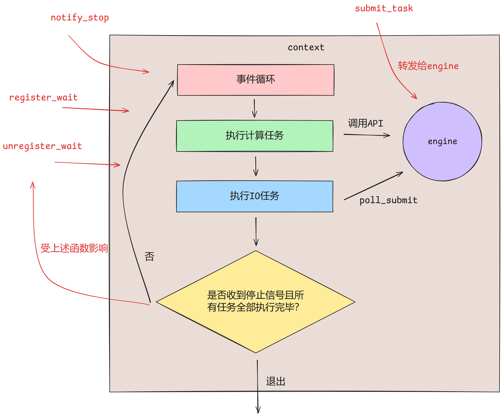

# tinyCoroLab2b: 构建任务执行引擎context

## tinyCoroLab2b实验简介

本节我们将正式开始tinyCoroLab2b，即构建任务执行引擎的子模块context。在lab2a中我们将engine比作武器，context比作士兵，只有装备了武器的士兵才能执行任务，而实现context的过程就像是在传授士兵如何去使用engine这把武器。在完成本节context的实现后tinyCoro的基础部分就正式完成了，即可正式对外提供服务。

#### 预备知识

> ⚠️预备知识即在实验开始前你应该已经掌握的知识

- **C++智能指针**
- **C++ jthread**

## 📖lab2b任务书

### 实验前置讲解

本节实验涉及到的核心文件为[include/coro/context.hpp](https://github.com/sakurs2/tinyCoroLab/blob/v1.0/include/coro/context.hpp)和[src/context.cpp](https://github.com/sakurs2/tinyCoroLab/blob/v1.0/src/context.cpp)，实验者需要预先打开文件浏览大致代码结构，下面针对该文件内容进行讲解。

首先每个context都是拥有一个engine的，并且会额外开启一个工作线程来驱动engine执行任务，这里context使用C++智能指针和jthread来管理工作线程。C++智能指针实验者应该熟悉，而jthread是C++20提供的新的线程类，其相比原本的thread增加了自动join和线程取消等功能，简化了线程管理的复杂性，比如jthread会在生命周期结束后自动join，jthread运行的函数可以带有stop_token来传递停止信号。

`context::start()`函数已经预先实现好，代码如下：

```cpp
auto context::start() noexcept -> void
{
    m_job = make_unique<jthread>(
        [this](stop_token token)
        {
            this->init();
            this->run(token); // 核心逻辑
            this->deinit();
        });
}
```

函数`run()`是context核心运行逻辑，由实验者实现。

总体上讲lab2b的代码量是较少的，但我仍然会为你展示context与engine的逻辑交互图来加深你的理解。



注意！交互图仅仅为了方便你理解，context的循环并不一定要按图中的顺序来，总之要保证在一次次循环中处理掉所有任务。

最后是对scheduler的讲解，读者可以打开[include/coro/scheduler.hpp](https://github.com/sakurs2/tinyCoroLab/blob/v1.0/include/coro/scheduler.hpp)和[src/scheduler.cpp](https://github.com/sakurs2/tinyCoroLab/blob/v1.0/src/scheduler.cpp)大致浏览代码。

scheduler已经预先实现好，且是单例模式实现，用户使用tinyCoro构建程序主要是下述流程：

```cpp
scheduler::init(); // 入参为context数量，默认为当前机器的逻辑cpu核心数
submit_to_scheduler(task); 
scheduler::start(); // 启动所有context
scheduler::loop(run_mode); 
```

对于`submit_to_scheduler`，如果配置参数是长期运行模式，那么task会根据scheduler的dispatcher（默认实现为round-robin）来决定派发到具体哪个context，如果是短期运行模式，那么只会派发到当前上下文绑定的context。

对于`scheduler::loop`，入参是运行模式，默认为配置参数定义的运行模式，在长期运行模式下，sheduler会直接调用context的join，此时context永远不会停止，因此scheduler永远阻塞在loop函数达到程序不会终止的效果。在短期运行模式下，sheduler会直接向各个context发送停止信号，并调用各个context的join来等待context执行完所有任务。

> 💡**感觉tinyCoro对于运行模式的设计不够统一？**
> 是的，后续版本会重构此部分，建议用户只在main函数中使用`submit_to_scheduler`，其余部分包括后续的实验全部使用`submit_to_context`。

### ⚠️注意事项

- 请确保已阅读过**tinyCoroLab Introduce**章节。
- 为了确保正确实现目标函数，实验者可能需要做一些额外操作：新增类、修改现有类的实现、补充现有类的方法和成员变量等操作，请遵循**free-design实验原则**。
- 你需要仔细评估待实现的接口是否需要是线程安全的。
- 任何导致测试卡住、崩溃等无法使测试顺利通过的情况都表明你的代码存在问题。

### 实验任务书

#### 🧑‍💻Task #1 - 完善context初始化以及外部交互API

##### 任务目标

对于context的`init()`与`deinit()`，其实现的注意事项与engine相同，任何需要被init或者deinit的成员变量均应该被正确处理，不要忘了将context注册到线程局部变量了使得协程运行时可通过`local_context()`获取与当前线程绑定的context。

对于外部用于提交任务的`submit_task(std::coroutine_handle<> handle)`，只需要调用engine的对应方法即可。

对于scheduler用于通知context的`notify_stop()`，实验者可以自行查资料看看jthread是如何搭配stop_token实现发送和接收停止信号的。

对于外部调用的`register_wait(int register_cnt)`和`unregister_wait(int register_cnt)`，这里需要为读者强调一下其作用。对于引用计数这个概念实验者一定不陌生，这是一种常见的确保资源正确释放的技巧，C++的智能指针其原理便是使用了引用计数，那么context和引用计数又有什么关系呢？

在之后的lab4和lab5中我们将会实现各种协程同步组件，用mutex来举例，如果一个协程尝试对已经被锁住的mutex上锁，那么该协程会陷入suspend状态，然后返回到engine的`exec_one_task()`函数继续后续流程。那么问题来了，前面讲过在短期运行模式下，scheduler会直接向context发送停止信号，context驱动engine，此时engine发现有一个任务待执行，而执行的正是对mutex加锁失败而陷入suspend状态的协程，当执行权返回到engine的`exec_one_task()`时，此时engine任务队列为空且没有IO任务，context察觉到了这一点，它检查了一遍停止条件：**收到停止信号且engine中没有任何待执行的任务（包括IO任务）**，它毅然决然地选择退出循环，终止工作线程。亲爱的，别告诉我你什么都没察觉，因为…………**一个协程未能得到完整执行且内存泄漏啦😱！！！**

而通过添加引用计数功能，context的停止条件也增加了一条：检查引用计数是否为0。上述陷入suspend状态的协程会调用`local_conetxt()`获取与其绑定的context并在陷入suspend状态前调用`register_wait(int register_cnt)`增加引用计数，而在协程恢复后调用`unregister_wait(int register_cnt)`来减少引用计数，这样才能拿保证所有的任务全被执行后context才会退出。

##### 涉及文件

- [include/coro/context.hpp](https://github.com/sakurs2/tinyCoroLab/blob/v1.0/include/coro/context.hpp)
- [src/context.cpp](https://github.com/sakurs2/tinyCoroLab/blob/v1.0/src/context.cpp)

##### 待实现函数

- `coro::context::init()`
- `coro::context::deinit()`
- `coro::submit_task(std::coroutine_handle<> handle)`
- `coro::register_wait(int register_cnt=1)`
- `coro::unregister_wait(int register_cnt = 1)`
- `coro::notify_stop()`

#### 补充说明

`notify_stop()`如果只是实现了其表面功能的话可能会出现问题，至于为什么？这正是实验的一个小难点，留给实验者自己发现并解决吧！

#### 🧑‍💻Task #2 - 完善context核心任务循环

##### 任务目标

本次任务仅仅涉及一个函数`run(stop_token token)`，这也是context最核心的工作线程函数，用于在循环中驱动engine执行完所有任务并优雅退出。由于lab2a以及前置讲解已经为本次任务铺垫了很多内容，因此不再过多赘述。

##### 涉及文件

- [include/coro/context.hpp](https://github.com/sakurs2/tinyCoroLab/blob/v1.0/include/coro/context.hpp)
- [src/context.cpp](https://github.com/sakurs2/tinyCoroLab/blob/v1.0/src/context.cpp)

##### 待实现函数

- `coro::context::run(stop_token token)`

### 🔖测试

#### 功能测试

功能测试场景主要针对：

- **多线程向context提交任务**
- **基于单个context的混合任务执行**
- **基于scheduler的混合任务执行**

完成本节实验后，实验者请在构建目录下执行下列指令来构建以及运行测试程序：

```shell
make build-lab2b # 构建
make test-lab2b # 运行
```

#### 内存安全测试

在构建目录下运行下列指令来执行内存安全测试：

```shell
make memtest-lab2b
```

测试通过会提示pass，不通过会给出valgrind的输出文件位置，请实验者根据该文件排查内存故障。
