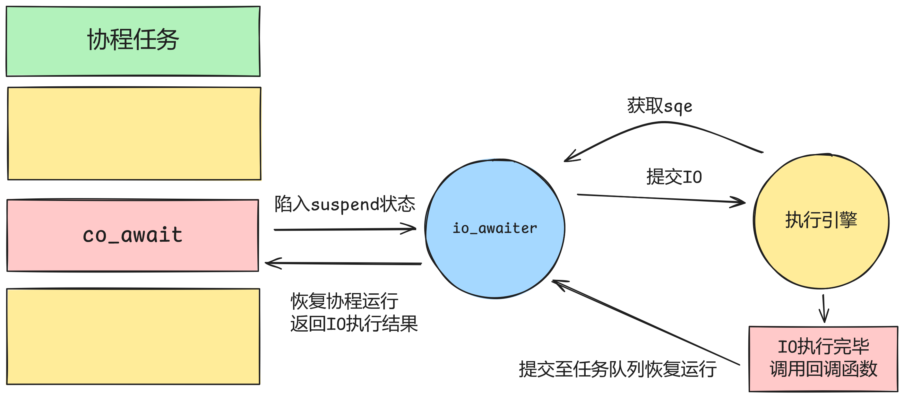

# tinyCoroLab3: 封装异步I/O执行模块

## tinyCoroLab3实验简介

本节我们将正式开始tinyCoroLab3，即封装异步I/O执行模块。在前面的实验中我们完成了执行引擎的构建，这表明tinyCoro此时已经正式可以对外提供服务了，但是库终究是要给用户使用的，我们要简化用户发起异步I/O的流程，这也是本次实验的核心任务所在。实验者应当了解liburing的设计目标之一是良好的拓展性，而本节实验正是要让实验者见证**liburing强大的可拓展性如何简化库开发者的开发流程**。

#### 预备知识

> ⚠️预备知识即在实验开始前你应该已经掌握的知识，且在[知识铺垫章节]()中均有涉及

- **io_uring的概念以及liburing的使用**
- **C++协程awaiter的概念**

## 📖lab3任务书

### 实验前置讲解

不同于前面的实验，lab3不需要实验者实现任何代码，所有代码都已经预先实现好，但代码的正确运行依赖于实验者在前置实验中对tinyCoro的正确实现，所以lab3仍然有功能测试，如果测试不通过实验者需要自行检查代码逻辑。

下面我们正式开始lab3的实验前置讲解，所涉及的核心代码均在文件夹[include/coro/net](https://github.com/sakurs2/tinyCoroLab/tree/v1.0/include/coro/net)和[src/net](https://github.com/sakurs2/tinyCoroLab/tree/v1.0/src/net)中，实验者需要预先打开文件浏览大致代码结构，下面针对该文件内容进行讲解。

首先是[include/coro/net/io_info.hpp](https://github.com/sakurs2/tinyCoroLab/blob/v1.0/include/coro/net/io_info.hpp)定义了执行IO所需要的一些基本类型定义，核心是`io_info`结构体，其定义以及各字段含义如下：

```cpp
struct io_info
{
    coroutine_handle<> handle; // IO绑定的协程句柄
    int32_t            result; // IO执行完的结果
    io_type            type; // IO类型
    uintptr_t          data; // IO绑定的内存区域
    cb_type            cb; // IO绑定的回调函数
};
```

然后转到[include/coro/net/base_awaiter.hpp](https://github.com/sakurs2/tinyCoroLab/blob/v1.0/include/coro/net/base_awaiter.hpp)，用户发起的异步IO均是通过在C++协程的awaiter中发起的，`base_io_awaiter`为所有IO相关的awaiter提供了一个基类并实现了awaiter的全部调度逻辑。当`base_io_awaiter`被构造时会自动从当前上下文绑定的engine获取一个sqe，当其被co_await时`base_io_awaiter`会在`await_suspend`中记录调用协程的句柄并使该协程陷入suspend状态。而在IO完成后会通过`await_resume`返回IO的执行结果。

> 💡**base_io_awaiter的await_suspend返回void，那岂不是不论发起什么样的IO，协程均会陷入suspend状态？**
> 是的，即使协程发起了一个轻量级的IO操作，但毕竟涉及到系统调用并不推荐以同步的方式等待完成。由于协程会陷入suspend状态所以针对某个协程可能其全部执行耗时比同步方式更长（因为执行引擎转移了执行权到其他协程），但在大量IO请求的情况下总体耗时会更短。

在定义好`base_io_awaiter`后我们就可以开始批量生产IO操作相关的awaiter了！请实验者查看文件[include/coro/net/io_awaiter.hpp](https://github.com/sakurs2/tinyCoroLab/blob/v1.0/include/coro/net/io_awaiter.hpp)和[src/net/io_awaiter.cpp](https://github.com/sakurs2/tinyCoroLab/blob/v1.0/src/net/io_awaiter.cpp)中的代码，我们以接受tcp连接举例，其定义如下：

```cpp
class tcp_accept_awaiter : public detail::base_io_awaiter
{
public:
    tcp_accept_awaiter(int listenfd, int flags) noexcept;

    static auto callback(io_info* data, int res) noexcept -> void;

private:
    inline static socklen_t len = sizeof(sockaddr_in);
};
```

首先与IO绑定的awaiter其构造函数应该包含发起IO需要的数据，比如`tcp_accept_awaiter`构造函数就包括监听文件描述符和标志位，然后所有的awaiter都必须添加一个回调函数且形式全部统一，该回调函数入参是`io_info`和IO操作返回值。

在构造函数中我们应该将数据填充到sqe中，具体步骤以及注释如下：

```cpp
tcp_accept_awaiter::tcp_accept_awaiter(int listenfd, int flags) noexcept
{
    m_info.type = io_type::tcp_accept; // 绑定io类型
    m_info.cb   = &tcp_accept_awaiter::callback; // 绑定回调函数

    io_uring_prep_accept(m_urs, listenfd, nullptr, &len, flags); // 为sqe填充数据
    io_uring_sqe_set_data(m_urs, &m_info);  // 将m_info绑定到sqe中
    local_engine().add_io_submit(); // 告诉执行引擎当前存在一个IO待提交
}
```

需要注意的是`io_uring_prep_accept`是liburing提供的用于发起接受tcp连接操作的api，而liburing本身支持的IO操作种类非常多，且均以`io_uring_prep_XXX`的形式命名，因此要想扩展tinyCoro对IO的支持，只需要查阅liburing手册查找相关IO对应的api，然后仿照`tcp_accept_awaiter`的写法就可以了。

`io_uring_sqe_set_data(m_urs, &m_info)`用于将io_info绑定到sqe中，这样在完成IO获得cqe后就可以根据io_info恢复处于suspend状态的协程了。

另外是回调函数，代码及注释如下：

```cpp
auto tcp_accept_awaiter::callback(io_info* data, int res) noexcept -> void
{
    data->result = res; // 在io_info中设置返回值，之后在io awaiter的await_resume函数中返回

    // 向当前上下文绑定的context提交协程句柄来恢复等待io的协程，
    // 在长期运行模式下也可以调用submit_to_scheduler
    submit_to_context(data->handle);
}
```

那么该回调函数怎么发挥作用呢？在lab2a中我们提到实验者只需要对从io_uring取出的cqe调用预先实现的`handle_cqe_entry`即可，而该函数的代码以及注释如下所示：

```cpp
auto engine::handle_cqe_entry(urcptr cqe) noexcept -> void
{
    // 取出绑定的io_info
    auto data = reinterpret_cast<net::detail::io_info*>(io_uring_cqe_get_data(cqe));
    // 调用io_info绑定的回调函数
    data->cb(data, cqe->res);
}
```

综上，我们就正式完成了tinyCoro对于接受tcp连接的支持，而[include/coro/net/io_awaiter.hpp](https://github.com/sakurs2/tinyCoroLab/blob/v1.0/include/coro/net/io_awaiter.hpp)中定义的其他IO比如向tcp发送和接收数据相关的awaiter也是同理，那么此时构建tcp服务器和客户端只差一步之遥了！

此时实验者请打开[include/coro/net/tcp.hpp](https://github.com/sakurs2/tinyCoroLab/blob/v1.0/include/coro/net/tcp.hpp)和[src/net/tcp.cpp](https://github.com/sakurs2/tinyCoroLab/blob/v1.0/src/net/tcp.cpp)，其中定义了tinyCoro对于tcp的简易支持，在tcpclient和tcpserver构造函数内是常见的socket编程，实验者应该并不陌生，但注意`tcp_server::accpet`、`tcp_client::connect`等IO相关的函数返回的是与IO关联的awaiter，通过`co_await awaiter`的方式就可以完成IO的发起了，而有了该文件定义的tcp相关的类我们就可以正式用tinyCoro搭建tcp程序了。

在文件夹[examples](https://github.com/sakurs2/tinyCoroLab/tree/v1.0/examples)中的`tcp_echo_server.cpp`、`tcp_echo_client.cpp`和`stdin_client.cpp`为实验者提供了一些实例，我们用最为有趣的stdin_client举例，该程序实现了一个tcp客户端并且可以支持用户终端输入发送到tcp服务端，其代码如下：

```cpp
#include "coro/coro.hpp"

using namespace coro;

#define BUFFLEN 10240

task<> echo(int sockfd)
{
    char buf[BUFFLEN] = {0};
    int  ret          = 0;
    auto conn         = net::tcp_connector(sockfd);

    while (true)
    {
        ret = co_await net::stdin_awaiter(buf, BUFFLEN, 0);
        log::info("receive data from stdin: {}", buf);
        ret = co_await conn.write(buf, ret);
    }
}

task<> client(const char* addr, int port)
{
    auto client = net::tcp_client(addr, port);
    int  ret    = 0;
    int  sockfd = 0;
    sockfd      = co_await client.connect();
    assert(sockfd > 0 && "connect error");

    submit_to_scheduler(echo(sockfd));

    char buf[BUFFLEN] = {0};
    auto conn         = net::tcp_connector(sockfd);
    while ((ret = co_await conn.read(buf, BUFFLEN)) > 0)
    {
        log::info("receive data from net: {}", buf);
    }

    ret = co_await conn.close();
    assert(ret == 0);
}

int main(int argc, char const* argv[])
{
    /* code */
    scheduler::init();
    submit_to_scheduler(client("localhost", 8000));

    scheduler::start();
    scheduler::loop(false);
    return 0;
}
```

我们首先开启一个终端运行下列指令来开启一个监听8000端口的tcp服务器：

```shell
nc -lk 8000
```

然后编译构建tinyCoro，开启一个终端运行stdin_client：

```shell
mkdir build
cd build
cmake ..
make
./bin/stdin_client
```

此时实验者可以在tcp服务端输入字符并回车发送，stdin_client会打印出接收的字符，然后实验者在stdin_client运行的终端中输入字符并回车发送，同样也会看到tcp服务端输出接收的字符。

最后让我们用一张图来总结io awaiter是如何支持tinyCoro实现IO操作的吧！



### 🔖测试

#### 实验前置环境

- 安装rust的构建工具cargo
- 安装python3.7及以上版本并确保命令行输入`python`是可以正确启动的

#### 功能测试

本节实验测试略微复杂，对于tinyCoro IO的功能测试，我们采用[rust_echo_bench](https://github.com/haraldh/rust_echo_bench)，这是一种可以对tcp服务器测试qps的压测工具，而tinyCoroLab自身在third_party里就包含了该工具，首先在项目构建目录下执行下列指令对压测工具进行构建（实验者需要预先安装rust的构建工具cargo）：

```shell
make build-benchtools
```

构建lab3测试程序：

```shell
make build-lab3
```

测试要求是使用rust_echo_bench在100个并发连接、负载为1kbyte且持续时长为30s的情况下对由tinyCoro搭建的[tcp_echo_server](https://github.com/sakurs2/tinyCoroLab/blob/v1.0/tests/lab3.cpp)进行压测，只要保证rust_echo_bench顺利输出结果就行。

一轮完整的测试流程如下所示:

- **step1**.启动tcp_echo_server，等待2s
- **step2**.检查tcp_echo_server是否仍在运行，如果**停止运行**则测试不通过，退出测试
- **step3**.启动rust_echo_bench，等待2s
- **step4**.检查rust_echo_bench是否仍在运行，如果**停止运行**则测试不通过，退出测试
- **step5**.等待40s
- **step6**.检查tcp_echo_server是否仍在运行，如果**停止运行**则测试不通过，退出测试
- **step7**.检查rust_echo_bench是否仍在运行，如果**正在运行**则测试不通过，退出测试
- **step8**.测试通过，打印测试结果

测试主程序为[tests/lab3_test.py](https://github.com/sakurs2/tinyCoroLab/blob/v1.0/tests/lab3_test.py)，需要注意的是在测试文件开头由这样一行：

```python
# test cases: [(<threadnum>, <port>) ...]
paras = [(1, 8000), (0, 8001)]
```

列表长度代表测试轮数，`(1, 8000)`表示tcp_echo_server只开启一个context并监听8000端口，`(0, 8001)`表示tcp_echo_server开启与本地机器cpu逻辑核心数相同的context数量并监听8001端口，实验者可以更改该列表中指定的端口号，但不能修改其他逻辑。

最后，在构建目录下通过下列指令来运行lab3的测试：

```shell
make test-lab3
```

测试程序会打印出详细结果，测试成功会提示pass。
