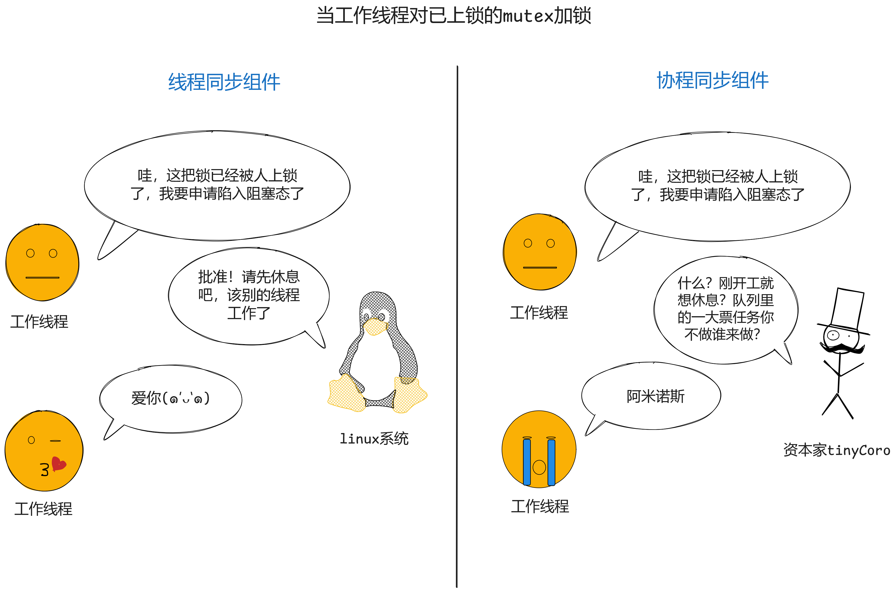
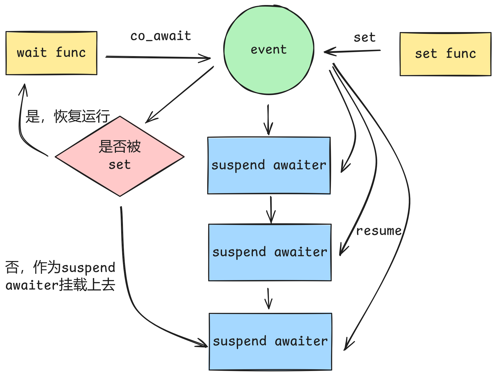

# tinyCoroLab4 pre: 如何构建协程同步组件

## tinyCoroLab4 pre实验简介

在开始本节实验前首先祝贺各位实验者通过了前3项测试🎉🎉🎉！而接下来实验者要面对的是tinyCoroLab中最为有趣的部分：**构建协程同步组件**。为了让实验者更好地理解什么是协程同步组件，我特此在lab4正式开始之前添加了本节lab4 pre作为预备知识部分，本节实验无代码，但概念至关重要，希望实验者确保在完全理解后进行后续实验。

#### 预备知识

> ⚠️预备知识即在实验开始前你应该已经掌握的知识，且在[知识铺垫章节]()中均有涉及

- **C++协程awaiter的概念**

## 📖lab4 pre任务书

### 实验讲解

#### 为何需要协程同步组件？

实验者在做tinyCoroLab前可能没有接触过协程，但至少多线程编程是或多或少了解的，利用现代cpu的并行计算能力提升系统执行速度，多线程编程可以说是现代程序最为基础的一种编程模型了。

多线程编程并非仅仅开启多个线程执行业务逻辑即可，因为在现代操作系统下各个线程共享内存空间，如果多个线程共同读写某个变量且不加以限制那么很容易出现预期外的结果，为了解决这个问题各个编程语言均引入了线程同步组件来确保多线程对共享变量操作的正确性，比如C++ stl中的mutex、condition_variable和promise等等。

使用线程安全组件确保了线程安全性后就可以高枕无忧了吗？并不是的，**如果使用线程安全组件不当或者其本身就比较低效那么线程花在线程同步的时间可能会成为性能瓶颈，严重的情况下多线程编程甚至会退化为单线程执行，即多线程失去了意义**。因此高效实现线程同步不仅依赖于正确使用线程安全组件，其组件本身也应当是高效的。

回到协程，我们知道协程是依托于线程之上执行的，拿tinyCoro举例，如果sheduler开启了16个context且向各个context派发一个协程任务，其任务逻辑是对一个全局变量进行自增，那么实验者将会发现，这其实和多线程没什么区别，同样会产生数据竞争问题导致出现预期外的结果，**那么有实验者可能会想，既然与多线程模型没啥区别，那么对全局变量的操作添加线程锁不就可以了吗**？可以，但不推荐，举个例子，C++程序中某个线程尝试对已经上锁的mutex加锁，那么线程会陷入阻塞态，受到操作系统调度机制的影响，该线程可能会让出执行权，**即工作线程暂时停止工作**。所以你看出问题了吗？如果使用线程组件那么tinyCoro执行引擎里存储的一大票协程任务均被阻塞，既然如此使用多线程编程就好了何必费劲心思搭建协程库呢？换句话说**使用线程同步组件那么协程带来的优势将不复存在！**

此时相信实验者已经明白为何要构建协程同步组件了，假如实验者已经实现了协程版的mutex，那么协程在尝试对已经上锁的mutex加锁时会陷入suspend状态，此时tinyCoro的执行引擎会选择执行任务队列里的其他任务，保证充分利用cpu，进而提升任务的执行效率。

按照惯例，我会给出一幅图来总结上述内容。



#### 如何构建协程同步组件？

既然实验者已经明白为何需要协程同步组件，那么下一步便是动手去实现了，在这里用lab4a将要实现的event举例，event的作用类似于C++中的promise，其大致使用过程如下：

```cpp
event<> ev;
task<> set_func() {
  ev.set();
}
task<> wait_func() {
  co_await ev.wait();
}
```

`wait_func`在`set_func`执行结束前是不会结束的，如果event没有被set，那么`wait_func`将一直陷入suspend状态，下面为大家演示一种event的设计思路。

当协程执行`co_await ev.wait()`时，awaiter会检查event是否被set，如果已经set了那么协程继续运行，如果没有set，那么awaiter会保存当前协程的句柄，将自身挂载到event的数据结构里，这个数据结构记录了所有挂载的awaiter，然后当前协程陷入suspend状态。

当协程执行`ev.set()`时，不仅会将event设置为set状态，还会检查event挂载awaiter的数据结构，然后依次取出awaiter，将其携带的协程句柄重新送入任务队列，即恢复各个协程的运行。

对event操作的具体流程示意图如下图所示：



不过需要注意对event的操作是多线程的，因此实现上应该保证线程安全性。

还有最重要的一点，在lab2b里提到context的引用计数防止协程任务suspend状态下执行引擎提前终止，而该功能在构建协程同步组件中正式派上用场，那么如何保证正确的的添加和减少引用计数呢？错误的操作可能导致任务完成后引用计数无法为0此时context永远无法停止。

得益于C++协程awaiter的支持，我们可以非常轻松的解决这个问题，当执行co_await awaiter时编译器会隐式生成代码调用awaiter的方法，也就是说一定存在下列的执行路径：

```txt
await_ready -> await_suspend -> await_resume // 当await_ready恒定返回某个值
await_ready -> await_resume // 当await_ready非恒定返回某个值
```

而执行路径又可被划分为suspend前和resume后这两个部分，我们只需要在suspend前增加引用计数，resume后降低引用计数即可。**不过需要强调的是某些协程同步组件可能会使一个协程多次陷入suspend状态，这个时候就需要实验者分析如何正确处理引用计数了。**

## 实验总结

本节为实验者展示了为何需要以及如何设计协程同步组件，请读者务必透彻理解上述内容，因为即将开始的lab4和lab5将由实验者亲自设计各种协程同步组件。
