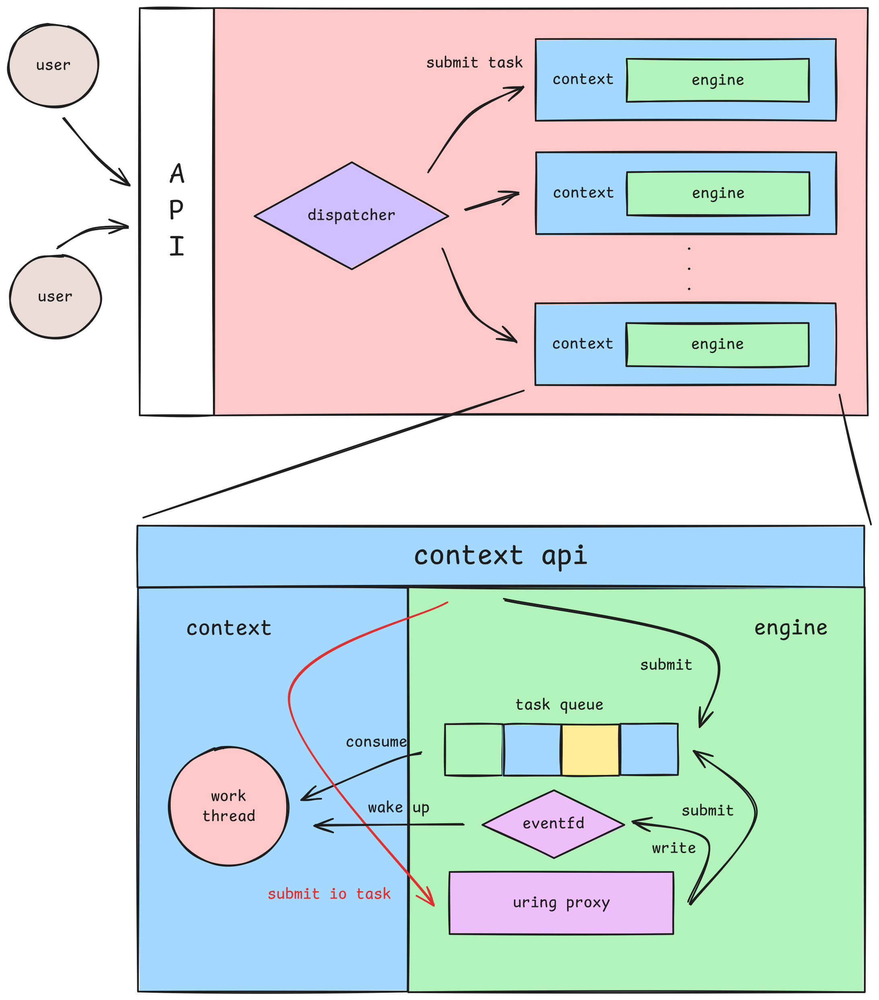
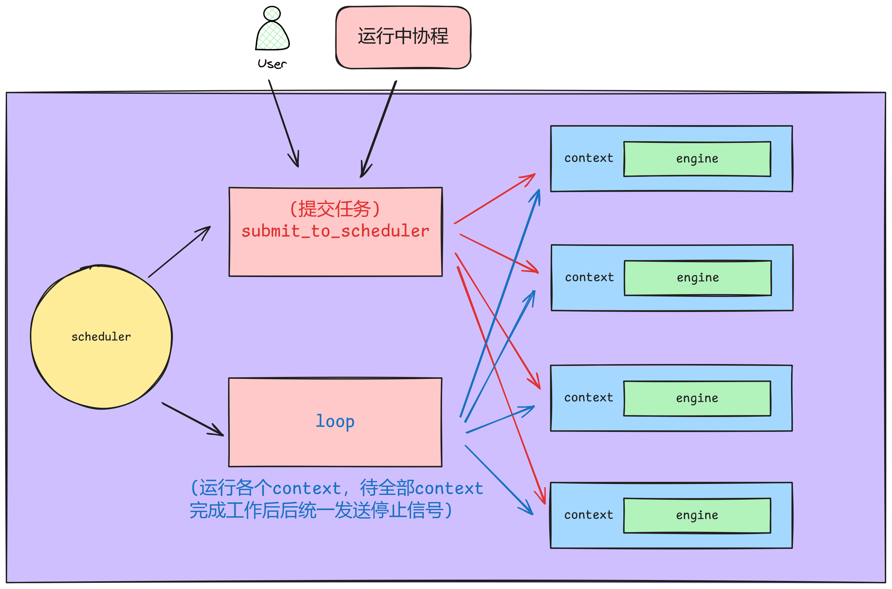

# tinyCoroLab Introduce

## tinyCoro介绍

[tinyCoroLab](https://github.com/sakurs2/tinyCoroLab)是一门以[tinyCoro](https://github.com/sakurs2/tinyCoro)为基础的实验课程，而[tinyCoro](https://github.com/sakurs2/tinyCoro)是一个linux系统环境下的以**C++20协程技术和linux io_uring技术相结合**的高性能异步协程库。高效且全能的io_uring和C++20无栈协程的轻量级切换相组合使得[tinyCoro](https://github.com/sakurs2/tinyCoro)可以轻松应对I/O密集型负载，而C++20协程的特性使得用户可以以同步的方式编写异步执行的代码，大大降低了后期维护的工作量，且代码逻辑非常简单且清晰，除此外**tinyCoro还提供了协程安全组件，以协程suspend代替线程阻塞便于用户构建协程安全且高效的代码。** 下图展示了[tinyCoro](https://github.com/sakurs2/tinyCoro)的任务调度机制：


[tinyCoro](https://github.com/sakurs2/tinyCoro)的设计并不复杂，每个执行引擎拥有一个工作线程和io_uring实例来处理外部任务，而调度器通过创建多个执行引擎来提高系统的并发能力，设计框架图如下所示：



经过测试由[tinyCoro](https://github.com/sakurs2/tinyCoro)实现的echo server在1kbyte负载和100个并发连接下可达到100wQPS，关于[tinyCoro](https://github.com/sakurs2/tinyCoro)更详细的信息请访问github主页。

## tinyCoroLab介绍

[tinyCoroLab](https://github.com/sakurs2/tinyCoroLab)的设计灵感来自于广为人知的CMU15445数据库内核实验和MIT6.824分布式实验，它们通过让学生编写指定接口的实现并通过大量的测试验证正确性来使得学生提高代码能力的同时学习到特定的领域知识，高难度的实验带来的是巨大的代码级和知识级的能力提升，这也使得这两门实验课程广受学生好评。而[tinyCoroLab](https://github.com/sakurs2/tinyCoroLab)沿袭这种设计思路，通过将[tinyCoro](https://github.com/sakurs2/tinyCoro)的实现拆分成多个子部分来构成5节实验课程，包括：

- **lab1:** 构建协程任务封装，包括lab1一个子实验
- **lab2:** 构建任务执行引擎，包括lab2a和lab2b两个子实验
- **lab3:** 封装异步I/O执行模块，包括lab3一个子实验
- **lab4:** 构建基础协程同步组件，包括lab4a，lab4b，lab4c，lab4d四个子实验
- **lab5:** 构建进阶协程同步组件，包括lab5a，lab5b，lab5c三个子实验

在上述实验的基础上[tinyCoroLab](https://github.com/sakurs2/tinyCoroLab)提供了200+项功能测试和内存安全测试来考察用户实现的功能逻辑正确性和内存安全性，并且lab4和lab5额外新增了性能测试通过googlebenchmark将基线模型与用户实现做对比来衡量用户实现的性能。除此之外[tinyCoroLab](https://github.com/sakurs2/tinyCoroLab)在cmake中定义了大量的指令来简化实验流程并提供一键生成perf性能分析火焰图的脚本，使得实验者可以专心于实现实验内容。

[tinyCoroLab](https://github.com/sakurs2/tinyCoroLab)并不像CMU15445和mit6.824课程那样涉及特定领域复杂的知识，因此难度稍弱，但其本身涉及到多线程下的高并发因此仍旧对实验者的代码能力仍有较强考验。[tinyCoroLab](https://github.com/sakurs2/tinyCoroLab)核心功能代码共计约2000行，测试加样例共计约4000行，而作为[tinyCoroLab](https://github.com/sakurs2/tinyCoroLab)的开源实现版本[tinyCoro](https://github.com/sakurs2/tinyCoro)在实验的基础上添加了约700行功能代码，因此实验者代码量预计在700行以下，耗时预计一个星期左右。

通过完成该实验，你将收获：

- **简历新增一个新颖、有技术含量且被深度量化过的项目。**
- **更加熟练的C++编程技巧，以及对C++新标准的应用。**
- **对强大的io_uring异步I/O技术的掌握。**
- **对多线程编程有更深入的理解。**

本实验学习了github开源且高star的C++项目的项目组织方式，如果你愿意研究该部分内容，你还将收获：

- **一个标准的通过cmake构建C++项目的方式。**
- **在项目中熟练运用单元测试、性能测试以及性能分析工具。**

## tinyCoroLab实验必读

### tinyCoroLab实验环境搭建

由于[tinyCoroLab](https://github.com/sakurs2/tinyCoroLab)使用了只在linux下支持的liburing，因此用户需要准备linux系统环境并使用尽量新的内核，wsl以及虚拟机均可，并预先安装好cmake以及支持C++20标准的gcc编译器。

首先实验者需要克隆[tinyCoroLab](https://github.com/sakurs2/tinyCoroLab)到本地：

```shell
git clone https://github.com/sakurs2/tinyCoroLab.git
```

初始化所有子模块：

```shell
cd tinyCoroLab
git submodule update --init --recursive
```

按下列步骤安装liburing：

> **⚠️最好不要使用系统包管理器来安装liburing，因为包管理器通常是旧版本，可能会出现功能bug，同时也请确保tinyCoroLab的cmake搜索到的liburing是最新版**

```shell
cd third_party/liburing/
./configure --cc=gcc --cxx=g++;
make -j$(nproc);
make liburing.pc
sudo make install;
```

上述步骤结束后回到[tinyCoroLab](https://github.com/sakurs2/tinyCoroLab)主目录，按下列步骤构建[tinyCoroLab](https://github.com/sakurs2/tinyCoroLab)：

```shell
mkdir build
cd build
cmake ..
make
```

编译成功后即表示[tinyCoroLab](https://github.com/sakurs2/tinyCoroLab)的环境正式搭建完毕。

### tinyCoroLab各模块介绍

```shell
$ tree -d -A -I third_party -I build -I .vscode -I resource -I temp
.
├── benchmark # 压测文件存放目录
│   ├── base_model # 基线模型（暂时废弃）
│   └── tinycoro_model # tinyCoro压测模型
├── benchtests # lab4和lab5的googlebenchmark测试文件存放目录 
├── config # 配置文件存放目录
├── examples # 使用tinyCoro构建的样例程序存放目录
├── include # tinyCoroLab核心头文件目录
│   └── coro
│       ├── comp # 协程同步组件存放目录
│       ├── concepts # C++ concepts文件存放目录
│       ├── detail # 辅助文件如类型定义和基础数据结构存放目录
│       └── net # 网络编程实现文件存放目录
├── scripts # 实验脚本文件存放目录
├── src # tinyCoroLab核心源文件目录
│   ├── comp
│   └── net
└── tests # 功能测试代码文件存放目录
```

上面的目录树展示了[tinyCoroLab](https://github.com/sakurs2/tinyCoroLab)的核心目录结构并用注释表明了各个目录的用途，下面我们针对各个模块的核心文件并讲解用途。

#### [config/config.h.in](https://github.com/sakurs2/tinyCoroLab/blob/master/config/config.h.in)

该文件存放了[tinyCoroLab](https://github.com/sakurs2/tinyCoroLab)的配置项，由于项目使用了cmake传递的变量所以配置文件是.h.in的文件格式并由cmake指令生成项目真正使用的配置文件config.h，因此实验者对配置的任何修改必须在[config.h.in](https://github.com/sakurs2/tinyCoroLab/blob/master/config/config.h.in)文件里，而对于config.h文件的修改会在重新执行cmake构建指令后被覆盖掉。

关于各个配置项的内容文件内均添加了注释，实验者保持默认设置参数即可。

1.1版本之前存在运行模式这一概念，在短期运行模式下没有任何待执行的任务的context会立刻退出，那么scheduler便无法派发任务至该context，这是不合理的。

在1.1版本`kLongRunMode=true`参数已废弃，含糊不清的运行模式概念已被删除，现在scheduler会在全部context完成执行后统一发送退出信号，这样协程在运行过程中就可以自由的向scheduler派发任务了，具体示意图如下：



<!-- 但关于[tinyCoroLab](https://github.com/sakurs2/tinyCoroLab)运行模式的配置项kLongRunMode务必重点说明一下，首先实验者需要理解[tinyCoroLab](https://github.com/sakurs2/tinyCoroLab)的核心设计是一个scheduler掌管多个context，而一个context即一个工作线程。

对于`kLongRunMode=true`即开启长期运行模式，此时所有的context永远都不会停止，且均有可能收到scheduler派发的任务，如果context在运行过程中产生新任务会交给scheduler来决定调度逻辑，这通过调用`submit_to_scheduler`函数实现。该模式适用于利用tinyCoro搭建长期运行的服务比如web服务器。

而对于`kLongRunMode=false`即短期运行模式，在context启动后会立刻收到scheduler发送的停止信号，如果此时context没有待执行的任务即会立刻停止，有待执行的任务会等任务执行完毕立刻停止，如果停止的context再接收到新的任务那么该任务将无法执行，因此在该模式下任务需要在context启动前提前由scheduler派发任务到各个context，而在运行过程中context产生的新任务也将交由自身执行来避免scheduler将任务派发到停止的context。该模式适用于一些短期计算任务，且实验中的测试均基于该模式运行。

具体的示意图如下：


不过具体运行逻辑受到多个参数影响，后续会详细介绍，实验者将`kLongRunMode`保持为默认true就可以。 -->

#### [include/coro](https://github.com/sakurs2/tinyCoroLab/tree/master/include/coro)

作为项目头文件存放目录，涉及到[tinyCoroLab](https://github.com/sakurs2/tinyCoroLab)的核心功能，下面给出各个子模块的详细作用：

- **[comp](https://github.com/sakurs2/tinyCoroLab/tree/master/include/coro/comp):** 用于存放协程同步组件的文件，即lab4和lab5的实验内容。
- **[concepts](https://github.com/sakurs2/tinyCoroLab/tree/master/include/coro/concepts):** C++20提供了一种新的编译检查机制即concepts。通过使用Concepts，开发者可以明确指定模板参数必须满足的条件，从而提高代码的可读性和可维护性，同时编译器可以在编译时检查这些条件是否满足，避免在实例化模板时出现意外的错误?。而该目录存放了[tinyCoroLab](https://github.com/sakurs2/tinyCoroLab)涉及到的concepts的定义。
- **[detail/container.hpp](https://github.com/sakurs2/tinyCoroLab/blob/master/include/coro/detail/container.hpp):** 该文件定义了一种数据存储容器，在实际开发中可能面临一种场景需要将数据暂存并延迟返回，而C++协程在返回值的时候也是需要先将返回值存储到promise对象再利用awaiter返回值，读者可能会疑惑额外定义一个变量存储不就行了，但C++是存在左值和右值以及移动和拷贝等概念的，如果值可被移动但你定义的容器仍然选择拷贝构造那么很容易造成性能损失，当然实际的情况可能更加复杂，所以定义该容器的目的就是为了对高效暂存数据提供一个统一的解决方案。原本该容器是[libcoro](https://github.com/jbaldwin/libcoro)中task的一部分，但在[tinyCoroLab](https://github.com/sakurs2/tinyCoroLab)中有多个组件需要需要临时存储变量，所以将该逻辑从task中剥离单独作为一个模块，实验者在实验过程中也可根据需要使用该容器。
- **[net](https://github.com/sakurs2/tinyCoroLab/tree/master/include/coro/net):** 这是[tinyCoroLab](https://github.com/sakurs2/tinyCoroLab)的网络模块，目前只实现了简易的tcp支持，在实验者完成lab1和lab2之后就可以利用该模块实现针对tcp的网络I/O编程了。
- **[atomic_que.hpp](https://github.com/sakurs2/tinyCoroLab/blob/master/include/coro/atomic_que.hpp):** 这里对第三方库[AtomicQueue](https://github.com/max0x7ba/atomic_queue)提供的高性能无锁环形队列进行了封装。
- **[log.hpp](https://github.com/sakurs2/tinyCoroLab/blob/master/include/coro/log.hpp):** [tinyCoroLab](https://github.com/sakurs2/tinyCoroLab)借助第三方库[spdlog](https://github.com/gabime/spdlog)提供的线程安全日志功能，引入该头文件后使用`log::info("hello {}","tinyCoro")`这种形式即可打印日志到终端，通过更改配置文件可实现额外打印到文件以及更改日志级别的功能。
- **[meta_info.hpp](https://github.com/sakurs2/tinyCoroLab/blob/master/include/coro/meta_info.hpp):** 存储全局共享以及线程局部变量的定义，有利于协程运行时获取上下文信息。
- **[spinlock.hpp](https://github.com/sakurs2/tinyCoroLab/blob/master/include/coro/spinlock.hpp):** 利用原子变量实现的一种自旋锁。
- **[uring_proxy.hpp](https://github.com/sakurs2/tinyCoroLab/blob/master/include/coro/uring_proxy.hpp):** 该文件对[liburing](https://github.com/axboe/liburing)进行了简单的二次封装，实验者可以在此基础上封装更多的功能。
- **[utils.hpp](https://github.com/sakurs2/tinyCoroLab/blob/master/include/coro/utils.hpp):** 存放工具函数。
- **[task.hpp](https://github.com/sakurs2/tinyCoroLab/blob/master/include/coro/task.hpp):** 协程支持模块，所有任务的基本单元即一个task，实验者将在lab1中完善该模块。
- **[engine.hpp](https://github.com/sakurs2/tinyCoroLab/blob/master/include/coro/engine.hpp):** engine作为[tinyCoroLab](https://github.com/sakurs2/tinyCoroLab)的心脏，即核心执行引擎，负责执行所有接收到的任务，包括异步执行I/O任务，实验者将在lab2a中完善该模块。
- **[context.hpp](https://github.com/sakurs2/tinyCoroLab/blob/master/include/coro/context.hpp):** context作为engine的封装，通过开启一个工作线程与engine交互确保所有接收到的任务都能顺利执行，实验者将在lab2b中完善该模块。
- **[dispatcher.hpp](https://github.com/sakurs2/tinyCoroLab/blob/master/include/coro/dispatcher.hpp):** 该模块负责具体的任务分发逻辑，[tinyCoroLab](https://github.com/sakurs2/tinyCoroLab)提供了最简单的round-robin式的任务分发方式。
- **[scheduler.hpp](https://github.com/sakurs2/tinyCoroLab/blob/master/include/coro/scheduler.hpp):** 采用单例模式实现的调度器，负责创建、运行以及终止批量context的运行，并根据dispatcher向各个context派发任务。

#### [scripts](https://github.com/sakurs2/tinyCoroLab/tree/master/scripts) & [tests](https://github.com/sakurs2/tinyCoroLab/tree/master/tests) & [benchtests](https://github.com/sakurs2/tinyCoroLab/tree/master/benchtests) & [benchmark](https://github.com/sakurs2/tinyCoroLab/tree/master/benchmark)

这四个文件夹存储了[tinyCoroLab](https://github.com/sakurs2/tinyCoroLab)用于执行功能测试、内存安全测试、性能测试和实验辅助脚本的文件，具体使用方法后续会详细介绍。

### tinyCoroLab实验小技巧

在了解[tinyCoroLab](https://github.com/sakurs2/tinyCoroLab)各个模块后，本节将会告诉大家如何正确的使用本实验精心构建并提供给实验者的各个技巧。注意本节提到的所有指令必须在构建目录下运行。

> **💡什么是构建目录？**
> 在cmake组织的C++项目根目录下新建build文件夹并在build下执行cmake ..构建项目，这个build文件夹即构建目录。

#### 特殊标记

当实验者在进行某项实验时，相关文件内会被添加特殊标记，标记不会对代码本身产生任何影响，其本身作为对实验的一种指示：

- **`[[CORO_TEST_USED(labXX)]]`：** 该标记一般出现在函数声明前，意为测试程序会使用此函数完成测试，请不要修改函数声明
- **`TODO[labXX]`：** 该标记一般出现在任意位置，表明此处可能需要实验者补充代码

#### debug & release模式切换

在主目录的[cmake文件](https://github.com/sakurs2/tinyCoroLab/blob/master/CMakeLists.txt)里有下面一行代码：

```cmake
option(ENABLE_DEBUG_MODE "Enable debug mode" OFF)
```

上述代码的含义即[tinyCoroLab](https://github.com/sakurs2/tinyCoroLab)默认采用release模式构建，而在release模式下项目会并开启-O3优化，如果实验者需要切换到debug模式可以将上述`ENABLE_DEBUG_MODE`改成默认值为ON或者利用下面的方式进行cmake构建：

```shell
mkdir build_debug
cd build_debug
cmake .. -DCMAKE_BUILD_TYPE=Debug
```

切换到debug模式后所有目标程序的构建将不再开启优化并添加-g编译选型。**建议读者针对debug模式和release模式分别在不同的文件夹下构建，不然因为cmake的cache机制在同一个文件夹下切换构建方式可能不会生效。**

> **⚠️debug的-O0模式下gcc不会对协程调用进行尾部递归优化，这使得协程在被循环调用多次（例如10w）后会出现栈溢出问题，由于是gcc的问题所以tinyCoro无法修复该bug，实验者需要特殊注意**

#### 功能测试&内存测试指令使用

[tinyCoroLab](https://github.com/sakurs2/tinyCoroLab)不仅在[tests](https://github.com/sakurs2/tinyCoroLab/tree/master/tests)文件夹下为实验者提供了大量的测试，还提供了多个指令方便实验者进行测试，指令清单如下，

| 指令 | 功能 |
|:-------:|:-------:|
| **make build-tests**  | 编译并列出所有测试  |
| **make check-tests**  | 运行所有测试，依赖测试程序的构建 |
| **make build-lab1**  | 编译lab1测试程序并列出测试清单  |
| **make test-lab1**  | 运行lab1测试程序，依赖测试程序的构建 |
| **make build-lab2a**  | 编译lab2a测试程序并列出测试清单  |
| **make test-lab2a**  | 运行lab2a测试程序，依赖测试程序的构建 |
| **make build-la2b**  | 编译lab2b测试程序并列出测试清单  |
| **make test-lab2b**  | 运行lab2b测试程序，依赖测试程序的构建 |
| **make build-lab3**  | 编译lab3测试程序并列出测试清单  |
| **make test-lab3**  | 运行lab3测试程序，依赖测试程序的构建 |
| **make build-lab4a**  | 编译lab4a测试程序并列出测试清单  |
| **make test-lab4a**  | 运行lab4a测试程序，依赖测试程序的构建 |
| **make build-lab4b**  | 编译lab4b测试程序并列出测试清单  |
| **make test-lab4b**  | 运行lab4b测试程序，依赖测试程序的构建 |
| **make build-lab4c**  | 编译lab4c测试程序并列出测试清单  |
| **make test-lab4c**  | 运行lab4c测试程序，依赖测试程序的构建 |
| **make build-lab4d**  | 编译lab4d测试程序并列出测试清单  |
| **make test-lab4d**  | 运行lab4d测试程序，依赖测试程序的构建 |
| **make build-lab5a**  | 编译lab5a测试程序并列出测试清单  |
| **make test-lab5a**  | 运行lab5a测试程序，依赖测试程序的构建 |
| **make build-lab5b**  | 编译lab5b测试程序并列出测试清单  |
| **make test-lab5b**  | 运行lab5b测试程序，依赖测试程序的构建 |
| **make build-lab5c**  | 编译lab5c测试程序并列出测试清单  |
| **make test-lab5c**  | 运行lab5c测试程序，依赖测试程序的构建 |

> **💡指令中的依赖是啥意思？**
> 比如**make test-lab1**是要执行测试程序，在没有依赖的情况下，如果测试程序未构建或者说发生更改后未重新构建，那么直接运行该指令会出现预期外的结果，因此需要添加依赖关系使得该命令执行时一定先构建测试程序，这种依赖关系是通过cmake文件添加的。

对于内存安全测试其逻辑是利用valrgind对功能测试的执行过程进行检查观察是否存在内存泄漏，并没有新增额外的测试逻辑，指令清单如下：

| 指令 | 功能 |
|:-------:|:-------:|
| **make memtest-lab1**  | 运行lab1内存安全测试，依赖测试程序的构建 |
| **make memtest-lab2a**  | 运行lab2a内存安全测试，依赖测试程序的构建 |
| **make memtest-lab2b**  | 运行lab2b内存安全测试，依赖测试程序的构建 |
| **make memtest-lab4a**  | 运行lab4a内存安全测试，依赖测试程序的构建 |
| **make memtest-lab4b**  | 运行lab4b内存安全测试，依赖测试程序的构建 |
| **make memtest-lab4c**  | 运行lab4c内存安全测试，依赖测试程序的构建 |
| **make memtest-lab4d**  | 运行lab4d内存安全测试，依赖测试程序的构建 |
| **make memtest-lab5a**  | 运行lab5a内存安全测试，依赖测试程序的构建 |
| **make memtest-lab5b**  | 运行lab5b内存安全测试，依赖测试程序的构建 |
| **make memtest-lab5c**  | 运行lab5c内存安全测试，依赖测试程序的构建 |

#### 性能测试指令使用

[tinyCoroLab](https://github.com/sakurs2/tinyCoroLab)针对lab4和lab5增设了由googlebenchmark编写的性能测试并存放在[benchtests](https://github.com/sakurs2/tinyCoroLab/tree/master/benchtests)文件夹下，每项实验的性能测试针对特定场景下的三种模型的性能对比，所有测试名称的前缀表示该测试使用的模型，具体前缀及含义如下所示：

- **thread_pool_stl_XX:** 使用简单的线程池和stl组件。
- **coro_stl_XX:** 使用coro调度器和stl组件。
- **coro_XX:** 使用coro调度器和coro组件。

**thread_pool_stl_XX**和**coro_stl_XX**的性能差距可表示coro调度器的开销，**coro_stl_XX**和**coro_XX**的性能差距可表示stl组件和实验者实现的组件之间的性能开销差距。

性能测试同样提供了多个指令方便实验者进行测试，指令清单如下，

| 指令 | 功能 |
|:-------:|:-------:|
| **make build-benchtests**  | 编译并列出所有测试指令 |
| **make benchbuild-lab4a**  | 编译lab4a性能测试程序 |
| **make benchtest-lab4a**  | 运行lab4a性能测试程序，依赖测试程序的构建 |
| **make benchbuild-lab4b**  | 编译lab4b性能测试程序 |
| **make benchtest-lab4b**  | 运行lab4b性能测试程序，依赖测试程序的构建 |
| **make benchbuild-lab4c**  | 编译lab4c性能测试程序 |
| **make benchtest-lab4c**  | 运行lab4c性能测试程序，依赖测试程序的构建 |
| **make benchbuild-lab4d**  | 编译lab4d性能测试程序 |
| **make benchtest-lab4d**  | 运行lab4d性能测试程序，依赖测试程序的构建 |
| **make benchbuild-lab5b**  | 编译lab5b性能测试程序 |
| **make benchtest-lab5b**  | 运行lab5b性能测试程序，依赖测试程序的构建 |
| **make benchbuild-lab5c**  | 编译lab5c性能测试程序 |
| **make benchtest-lab5c**  | 运行lab5c性能测试程序，依赖测试程序的构建 |

#### I/O benchmark测试指令

与上一小节提到的性能测试不同，I/O benchmark测量的是使用tinyCoro构建的echo server在压测工具下所能达到的QPS，实验者在完成lab3后可以使用该测试测算个人实现版本的QPS，详细的测试过程请阅读[benchmark/README.MD](https://github.com/sakurs2/tinyCoroLab/blob/master/benchmark/README.MD)。

#### 性能分析火焰图一键生成指令

本实验为了方便实验者定位程序的性能瓶颈，额外增设了性能分析火焰图一键生成指令，关于该指令的使用请阅读[scripts/README.MD](https://github.com/sakurs2/tinyCoroLab/blob/master/scripts/README.MD)。

#### 快速构建调试程序

实验者可能需要对某个逻辑编写功能自行测试但又不想动编写cmake代码来添加额外的编译过程，那么可以使用本实验提供的快速构建调试程序来解决这个问题。

在[examples](https://github.com/sakurs2/tinyCoroLab/tree/master/examples)文件夹下新增`coro_debug.cpp`，该文件默认被添加到[.gitignore](https://github.com/sakurs2/tinyCoroLab/blob/master/.gitignore)中，然后用cmake重新构建项目，此时项目会额外新增两个指令，清单如下：

| 指令 | 功能 |
|:-------:|:-------:|
| **make build-debug**  | 编译coro_debug.cpp构建可执行文件coro_debug |
| **make run-debug**  | 运行coro_debug，依赖coro_debug的构建 |

使用上述两个指令可以避免实验者编写多余的cmake代码以及避免默认make构建全部目标带来的时间消耗。

### tinyCoroLab测试设计原则

tinyCoroLab的测试涉及遵循三大原则：

- **明确**：不论是单线程还是多线程，测试点的结果一定是明确且固定的。
- **理智**：测试程序就像一个理智的用户一样，懂得如何正确使用tinyCoro编写代码，这也意味着所有的测试错误一定是归结于实验者编写的逻辑。
- **集中**：测试程序会且仅会使用使用任务书提到的接口，其余均不会涉及。

有关测试的任何问题请及时向作者反馈。  

### free-design实验原则

实验者在实验过程中不必纠结某些预定义好的代码能不能改或者实验指导书没提到的地方能不能动，只需要记住一个原则：**让所有测试可被成功编译**。在此基础上你可以任意修改tinyCoroLab的内容（当然测试是不可以被更改的），比如新增文件、新增现有类方法、添加成员变量等等。
